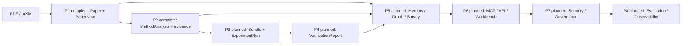

<div align="center">

# 🔬 ReproForge

**Automated Paper Reading, Methodology Analysis & Reproduction for CS Research**

[](https://github.com/selfrestart/26Summer/actions/workflows/ci.yml)
[](#project-status)
[](pyproject.toml)
[](LICENSE)
[](https://github.com/selfrestart/26Summer/tree/main/repro-forge/docs)
[](CONTRIBUTING.md)

</div>

---

## What is ReproForge?

ReproForge aims to become a multi-agent framework for reading, understanding, and reproducing computer science research papers. The planned system uses **six specialized AI agents** that collaborate to:

1. **Read** — parse PDFs into structured notes with layered summaries
2. **Analyze** — extract algorithms, architectures, and mathematical derivations
3. **Verify** — cross-check formula consistency and derivation gaps
4. **Implement** — generate clean, runnable PyTorch/TensorFlow reproduction code
5. **Execute** — run experiments in Docker sandboxes with MLflow tracking
6. **Validate** — compare reproduced metrics against claimed results

---

## Capabilities and Roadmap

> **Capability boundary:** the table below includes roadmap targets. P0, P1 and P2
> are implemented; P1 covers local PDF/arXiv ingestion, token-aware chunking,
> the PaperReader agent, provider injection, and the `PaperPipeline`/CLI.
> Phase status follows the [roadmap lifecycle](docs/ROADMAP.md#3-状态生命周期与实施准入).
> P2 adds evidence-grounded methodology extraction through `MethodAnalysis` and
> `MethodologyPipeline`; code generation and execution remain P3+ work.

| Phase | Status | Capability |
|-------|--------|------------|
| **P0 Engineering Core** | Complete | Typed ReAct runtime, provider contract, deterministic tests, CI, docs, package and CLI image |
| **P1 Paper Reading** | Complete | Local PDF/arXiv ingestion, token-aware chunking, PaperReader, `PaperNote`, pipeline and CLI |
| **P2 Method Extraction** | Complete | Versioned `MethodAnalysis` with source-bound evidence, equation capture status and raw claim drafts |
| **P3 Code and Experiments** | Planned | Auditable `ReproductionBundle`, dry-run and minimally safe sandbox execution |
| **P4 Verification** | Planned | MathChecker, claim/metric alignment and `VerificationReport` |
| **P5 Research Memory** | Planned | Versioned artifact repository, ChromaDB/Neo4j indexes and SurveyScribe |
| **P6 Product Surface** | Planned | Shared application service, MCP, FastAPI jobs/SSE and React workbench |
| **P7 Security** | Planned | Identity, policy engine, guardrails, supply-chain controls and audit |
| **P8 Quality Platform** | Planned | Benchmarks, OpenTelemetry, cost tracking and release scorecards |

---

## P1 Quick Start

### Prerequisites

- [uv](https://docs.astral.sh/uv/) — fast Python package manager (auto-manages Python 3.11+ via `.python-version`)
- No API key is required for the deterministic examples and test suite

### Installation

```bash
# Clone and one-command setup
git clone https://github.com/selfrestart/26Summer.git
cd 26Summer/repro-forge
uv sync --locked --group dev

# Verify the installed package and P1 capabilities
uv run repro-forge --version
uv run repro-forge capabilities
uv run pytest
uv run ruff check repro_forge tests
uv run mypy repro_forge
```

### Optional P1 Integrations

Install only the integrations you need:

```bash
uv sync --locked --extra pdf --group dev       # local PDF parsing
uv sync --locked --extra arxiv --group dev     # arXiv search/download
uv sync --locked --extra openai --group dev    # OpenAI-compatible LLM

# For real LLM-backed reading, set OPENAI_API_KEY or DEEPSEEK_API_KEY in .env
```

### 5-Minute Quickstart

### Read a paper with P1

```python
from dotenv import load_dotenv

from repro_forge.paper import PaperPipeline
from repro_forge.providers import OpenAIProvider

load_dotenv()

# 1. Parse a paper and get structured insights
pipeline = PaperPipeline(provider=OpenAIProvider())
note = await pipeline.read_pdf("path/to/paper.pdf")
print(note.tldr)
print(note.summary())
```

For an offline run, use `uv run python examples/read_paper.py`, which uses a
deterministic provider and does not require a PDF or API key.

### Run a Full Reproduction

> **Planned API:** reproduction is scheduled for P3/P4 and is not implemented
> in the current P2 release. P2 produces the evidence-grounded
> `MethodAnalysis` consumed by P3.

No copy-paste API is shown for this workflow because those imports do not exist
yet. The planned sequence is P2 `MethodAnalysis` → P3 `ReproductionBundle` and
`ExperimentRun` → P4 `VerificationReport`. See the [P2](docs/P2-IMPLEMENTATION-PLAN.md),
[P3](docs/P3-IMPLEMENTATION-PLAN.md), and [P4](docs/P4-IMPLEMENTATION-PLAN.md)
plans for proposed contracts and completion gates.

---

## Current and Target Architecture



---

## Documentation

Full documentation is available in the repository's [docs directory](https://github.com/selfrestart/26Summer/tree/main/repro-forge/docs).

- [Getting Started](docs/getting-started/installation.md)
- [User Guide](docs/user-guide/paper-reading.md)
- [Architecture](docs/architecture/overview.md)
- [P0-P8 Roadmap](docs/ROADMAP.md)
- [API Reference](docs/api-reference/core.md)
- [Examples](docs/examples/paper-dive.md)

---

## Project Status

| Phase | Status | Content |
|-------|--------|---------|
| P0 | ✅ Complete | Core abstractions, tests, packaging, CI, docs build, Docker package image |
| P1 | ✅ Complete | PaperReader, PDF/arXiv parsers, chunker, provider boundary, pipeline, CLI |
| P2 | ✅ Complete | Methodologist, evidence-grounded method/architecture/training extraction |
| P3 | 📋 Planned | Auditable CodeForger bundles, dry-run and sandboxed experiment execution |
| P4 | 📋 Planned | MathChecker, claim/metric alignment, Verifier and reproduction reports |
| P5 | 📋 Planned | Versioned memory, knowledge graph and evidence-grounded surveys |
| P6 | 📋 Planned | Shared application service, MCP, FastAPI jobs/SSE and React workbench |
| P7 | 📋 Planned | Identity, policy engine, guardrails, execution hardening and audit |
| P8 | 📋 Planned | Benchmarks, OpenTelemetry, cost tracking and release scorecards |

`Planned` means the scope is documented, not that implementation may begin or
that a placeholder package/configuration is usable. See the roadmap's
Definition of Ready, stage gates, and safe stopping milestones.

---

## Community

- 🗣 [GitHub Discussions](https://github.com/selfrestart/26Summer/discussions) — Q&A & feature proposals
- 🐛 [Issues](https://github.com/selfrestart/26Summer/issues) — Bug reports & tasks
- 📖 [Contributing Guide](CONTRIBUTING.md) — How to get involved

### Contributor Ladder

```
User → Contributor (any accepted PR) → Reviewer (3+ PRs)
                                      → Maintainer (2 months active)
                                      → PMC (core governance vote)
```

---

## Citation

If you use ReproForge in your research, please cite:

```bibtex
@software{reproforge2025,
  author = {ReproForge Contributors},
  title = {ReproForge: Automated Paper Reading \& Reproduction for CS Research},
  year = {2025},
  url = {https://github.com/selfrestart/26Summer/tree/main/repro-forge},
}
```

---

## License

This project is licensed under the Apache License 2.0 — see [LICENSE](LICENSE) for details.

---

<div align="center">
  <sub>Built with ❤️ by the ReproForge community</sub>
</div>
