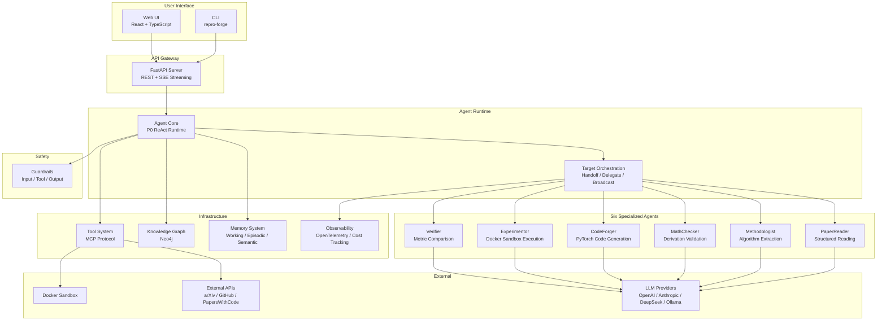

# ReproForge Architecture

**Automated Paper Reading, Methodology Analysis & Reproduction for CS Research**

> This document provides an English-language overview of the ReproForge
> system architecture for international visitors. For in-depth design
> rationale (why each decision was made), see
> [P0-DESIGN-RATIONALE.md](P0-DESIGN-RATIONALE.md).
>
> For configuration and command references, see
> [P0-TECHNICAL-REFERENCE.md](P0-TECHNICAL-REFERENCE.md).
>
> **Implementation boundary:** P1 currently implements the paper-reading
> vertical slice (`PDFParser`/`ArxivClient` → `PaperChunker` → `PaperReader` →
> `PaperNote`). P0 and P1 are complete; P2 through P8 are planned. The
> multi-agent, reproduction, memory, MCP, API, security, evaluation, and UI
> elements below are target architecture unless a table marks them complete.

For the current implementation in Chinese, see
[architecture/overview.md](architecture/overview.md). For P1 decisions and
concrete commands, see [P1-DESIGN-RATIONALE.md](P1-DESIGN-RATIONALE.md) and
[P1-TECHNICAL-REFERENCE.md](P1-TECHNICAL-REFERENCE.md). The authoritative
phase boundaries and completion rules are in the [P0-P8 Roadmap](ROADMAP.md).

---

## 1. Project Overview

ReproForge addresses the **Reproducibility Crisis** in computer science
research. The current P1 release provides a working paper-reading vertical
slice; the complete multi-agent pipeline is the planned end state.

The target system uses **six specialized AI agents** to read papers, extract
algorithms, verify math, generate runnable code, execute experiments in
sandboxed environments, and compare results against claimed metrics.

| Phase | Status | Architectural responsibility |
|-------|--------|------------------------------|
| P0 | Complete | Core types, ReAct lifecycle, provider contract, tests, CI, docs, packaging |
| P1 | Complete | PDF/arXiv ingestion, chunking, PaperReader, PaperNote, pipeline, CLI |
| P2 | Planned | Methodologist plus source-bound evidence, equation capture status, raw claim drafts, and `MethodAnalysis` |
| P3 | Planned | CodeForger bundles and minimally safe experiment execution |
| P4 | Planned | MathChecker, claim/metric alignment, Verifier reports |
| P5 | Planned | Artifact repository, memory, knowledge graph, SurveyScribe |
| P6 | Planned | Application service, MCP, FastAPI jobs/SSE, React workbench |
| P7 | Planned | Identity, policy, guardrails, execution hardening, audit |
| P8 | Planned | Benchmarks, OpenTelemetry, cost tracking, release scorecards |

---

## 2. System Architecture



### Layer Architecture (Dependency Direction: Top → Bottom)

```
Layer 6: Web UI (React)                                      [P6 planned]
Layer 5: API Gateway (FastAPI)                               [P6 planned]
Layer 4: Agent Pipeline (specialists + orchestration)         [P1 partial; P2-P6 planned]
Layer 3: Domain Services (paper parsing, reproduction)        [P1 partial; P2-P4 planned]
Layer 2: Infrastructure (artifact, memory, graph, MCP, tools) [P5-P6 planned]
Layer 1: Core (types, base agent, provider abstraction)       [P0 complete]
```

Lower layers never depend on upper layers (Dependency Inversion).

---

## 3. Agent System Design

### 3.1 Agent Roles & Responsibilities

| Agent | Phase/status | Input | Output | Key responsibility |
|-------|--------------|-------|--------|--------------------|
| **PaperReader** | P1 complete | PDF / arXiv ID | `PaperNote` | Parse, chunk, and summarize papers with traceable source context |
| **Methodologist** | P2 planned | `Paper` + optional `PaperNote` | `MethodAnalysis` + evidence/equation/claim drafts | Extract methods, architectures, training configs, and evaluation protocols without inventing missing source content |
| **CodeForger** | P3 planned | `MethodAnalysis` | `ReproductionBundle` | Generate auditable source, configs, dependencies, and tests |
| **Experimentor** | P3 planned | `ReproductionBundle` | `ExperimentRun` | Execute dry-run/build/run steps in a minimally safe sandbox |
| **MathChecker** | P4 planned | Equations + P2 evidence | `MathCheckReport` | Check symbols, dimensions, and derivation gaps |
| **Verifier** | P4 planned | Claims + `ExperimentRun` | `VerificationReport` | Align metrics/datasets/splits and compare observations with claims |

### 3.2 Execution Modes

| Mode | Strategy | When to Use |
|------|----------|------------|
| **ReAct** | Think → Act → Observe → Repeat | Implemented in P0 and used by P1 PaperReader |
| **Plan-Execute style** | Plan → Execute Steps Sequentially | Planned for P3 code generation and experiment execution |

### 3.3 Inter-Agent Communication

| Protocol | Semantics | Example |
|----------|-----------|---------|
| **Handoff** | Full context transfer | Target protocol; PaperReader → Methodologist |
| **Delegate** | Subtask assignment with result collection | Target protocol; orchestrator → workers |
| **Broadcast** | Notify interested agents | Target protocol; artifact or citation update |

These communication protocols are design vocabulary, not P1 public APIs.

### 3.4 Design Philosophy: Why Not LangChain?

The core challenge in paper reproduction is **domain modeling**—representing
papers, algorithms, and experimental results as structured types—not simply
chaining LLM calls. Building a custom agent framework provides:

1. **Deep understanding** of think-act-observe loop internals
2. **Tailored type system** (`Algorithm`, `Architecture`, `ExperimentConfig`)
3. **Custom evaluation metrics** (reproduction fidelity, not dialogue quality)
4. **Interview-ready depth** on every architectural decision

---

## 4. Target Data Flow: The Reproduction Pipeline

```
Paper PDF
    │
    ▼
┌─────────────┐
│ PaperReader  │  P1 complete: parse sections → PaperNote
└──────┬──────┘
       │
       ▼
┌─────────────┐
│Methodologist│  P2 planned: MethodAnalysis + evidence
└──────┬──────┘
       │
       ├──────────────────┐
       ▼                  ▼
┌─────────────┐   ┌─────────────┐
│ CodeForger  │   │MathChecker  │
│ P3 planned  │   │ P4 planned  │
│ bundle      │   │ math report │
└──────┬──────┘
       │
       ▼
┌─────────────┐
│Experimentor │  P3 planned: isolated dry-run/build/run → ExperimentRun
└──────┬──────┘
       │
       ▼
┌─────────────┐
│  Verifier   │  P4 planned: align claims/metrics → verification report
└──────┬──────┘
       │
       ▼
  Reproduction Report (P4 planned)
```

### Parallel Path: Literature Survey (P5 Planned)

When searching for "all attention-variant papers on ImageNet," the
knowledge graph supports graph-traversal queries alongside keyword
and vector search, enabling:

- Method evolution path tracing
- Benchmark-focused method comparison
- Automated survey section generation

---

## 5. Technology Stack

| Layer | Technology | Status | Rationale |
|-------|------------|--------|-----------|
| **Lang** | Python 3.11+ | Current | Rich ML ecosystem, async/await native support |
| **Package Manager** | uv | Current | Fast, locked, reproducible environments |
| **Lint / Format** | Ruff | Current | One fast tool for formatting and linting |
| **Type Check** | mypy strict | Current | Type safety across async module boundaries |
| **Build** | hatchling | Current | PEP 621-compliant package builds |
| **Test** | pytest + asyncio | Current | Deterministic fake-provider and pipeline tests |
| **Docs** | MkDocs Material | Current | Markdown-first docs and Mermaid diagrams |
| **CI/CD** | GitHub Actions | Current | Multi-version quality, test, build, and docs jobs |
| **LLM** | OpenAI-compatible HTTP | P1 complete | Supports OpenAI, DeepSeek, Qwen, vLLM, Ollama-compatible endpoints |
| **Experiment sandbox/tracking** | Docker + MLflow | P3 planned | Isolated execution and structured run records |
| **Artifact/vector storage** | local metadata + ChromaDB | P5 planned | Versioned facts plus rebuildable semantic index |
| **Graph DB** | Neo4j + NetworkX | P5 planned | Production graph queries plus lightweight contract tests |
| **API/MCP/UI** | FastAPI + MCP + React | P6 planned | Shared application service exposed to humans and machines |
| **Security** | policy engine + guardrails | P7 planned | Identity, authorization, tool policy, audit, supply-chain gates |
| **Tracing/evaluation** | OpenTelemetry + benchmark suite | P8 planned | Vendor-neutral telemetry and evidence-backed release gates |
| **License** | Apache 2.0 | Current | Enterprise-friendly terms and explicit patent grant |

---

## 6. Repository Structure

```
26Summer/                          # GitHub repository root (umbrella workspace)
│
├── .github/                       # CI/CD + community templates
│   ├── workflows/
│   │   ├── ci.yml                 # PR: lint + typecheck + multi-version test
│   │   ├── release.yml            # Tag: build + verify artifact
│   │   └── docs.yml               # Push: auto-deploy to GitHub Pages
│   ├── ISSUE_TEMPLATE/            # bug_report / feature_request / reproduction_task
│   ├── PULL_REQUEST_TEMPLATE.md
│   └── dependabot.yml             # Weekly pip + actions updates
│
├── repro-forge/                   # Main project directory
│   ├── repro_forge/               # Python package
│   │   ├── core/                  #   types (29 classes) + base agent (ReAct loop)
│   │   ├── agents/                #   P1 PaperReader; P2-P5 agents planned
│   │   ├── paper/                 #   P1 pipeline; P2 extraction planned
│   │   ├── reproduction/          #   Empty namespace; P3-P4 planned
│   │   ├── memory/                #   Empty namespace; P5 planned
│   │   ├── knowledge/             #   Empty namespace; P5 planned
│   │   ├── mcp/                   #   Empty namespace; P6 planned
│   │   ├── providers/             #   Multi-LLM abstraction layer
│   │   ├── tools/                 #   Namespace; P1 tools remain inside PaperReader
│   │   ├── guardrails/            #   Empty namespace; P7 planned
│   │   ├── evaluation/            #   Empty namespace; P8 planned
│   │   ├── observability/         #   Empty namespace; P8 planned
│   │   └── api/                   #   Empty namespace; P6 planned
│   │
│   ├── tests/
│   │   ├── conftest.py            #   FakeLLMProvider + FakeAgent + fixtures
│   │   ├── unit/                  #   P0/P1 unit and contract coverage
│   │   ├── integration/
│   │   └── e2e/
│   │
│   ├── docs/
│   │   ├── P0-DESIGN-RATIONALE.md    # Interview-oriented design rationale
│   │   ├── P0-TECHNICAL-REFERENCE.md # Technical reference manual
│   │   ├── ARCHITECTURE.md           # This document
│   │   └── mkdocs.yml                # Material-themed documentation site
│   │
│   ├── examples/                  # Runnable example scripts
│   ├── notebooks/                 # Jupyter notebook demos
│   ├── pyproject.toml             # Single-source project config
│   ├── Dockerfile                 # Multi-stage (builder + runtime)
│   └── compose.future.yml         # P5/P8 service templates, not current runtime
│
├── LICENSE                        # Apache 2.0
├── README.md                      # Umbrella workspace overview
└── .gitignore
```

---

## See Also

- **[P0-DESIGN-RATIONALE.md](P0-DESIGN-RATIONALE.md)** — Why each technology and architecture decision was made
- **[P0-TECHNICAL-REFERENCE.md](P0-TECHNICAL-REFERENCE.md)** — Complete configuration, commands, and module reference
- **[ROADMAP.md](ROADMAP.md)** — Authoritative P0-P8 scope, status, contracts, and quality gates
- **[Development Workflow](development/workflow.md)** — Day-to-day development guide
- **[Testing Strategy](development/testing.md)** — Test pyramid and FakeLLMProvider design
