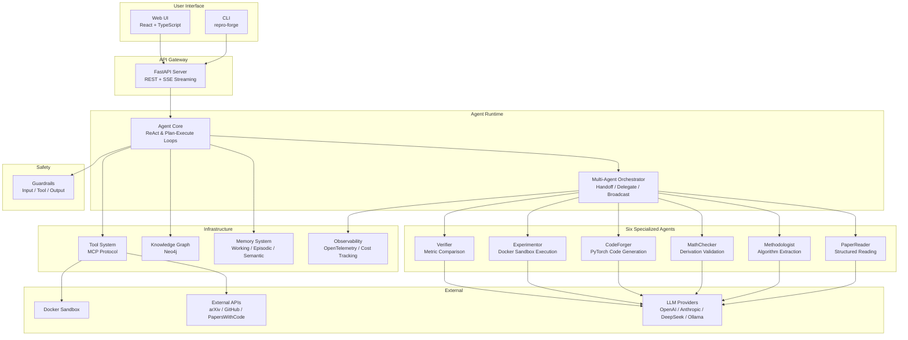

# ReproForge Architecture

**Automated Paper Reading, Methodology Analysis & Reproduction for CS Research**

> This document provides an English-language overview of the ReproForge
> system architecture for international visitors. For in-depth design
> rationale (why each decision was made), see
> [P0-DESIGN-RATIONALE.md](P0-DESIGN-RATIONALE.md).
>
> For configuration and command references, see
> [P0-TECHNICAL-REFERENCE.md](P0-TECHNICAL-REFERENCE.md).
>
> **Implementation boundary:** P1 currently implements the paper-reading
> vertical slice (`PDFParser`/`ArxivClient` → `PaperChunker` → `PaperReader` →
> `PaperNote`). The six-agent, memory, MCP, API, and UI elements below are
> target architecture unless explicitly marked as P1.

For the current implementation in Chinese, see
[architecture/overview.md](architecture/overview.md). For P1 decisions and
concrete commands, see [P1-DESIGN-RATIONALE.md](P1-DESIGN-RATIONALE.md) and
[P1-TECHNICAL-REFERENCE.md](P1-TECHNICAL-REFERENCE.md).

---

## 1. Project Overview

ReproForge addresses the **Reproducibility Crisis** in computer science
research. The current P1 release provides a working paper-reading vertical
slice; the complete multi-agent pipeline is the planned end state.

**Six specialized AI agents** collaborate to read papers, extract
algorithms, verify math, generate runnable code, execute experiments in
sandboxed environments, and compare results against claimed metrics.

---

## 2. System Architecture



### Layer Architecture (Dependency Direction: Top → Bottom)

```
Layer 6: Web UI (React)
Layer 5: API Gateway (FastAPI)
Layer 4: Agent Pipeline (6 Agents + Orchestrator)
Layer 3: Domain Services (paper parsing, reproduction engine)
Layer 2: Infrastructure (memory, knowledge graph, MCP, tools)
Layer 1: Core (types, base agent, LLM provider abstraction)
```

Lower layers never depend on upper layers (Dependency Inversion).

---

## 3. Agent System Design

### 3.1 Agent Roles & Responsibilities

| Agent | Input | Output | Key Responsibility |
|-------|-------|--------|-------------------|
| **PaperReader** | PDF / arXiv ID | Structured notes + layered summaries | Parse, chunk, and summarize academic papers |
| **Methodologist** | PaperReader output | Algorithm pseudocode + architecture descriptions | Extract methods, architectures, training configs |
| **MathChecker** | Extracted formulas | Derivation validation report | Cross-check formula consistency and derivation steps |
| **CodeForger** | Methodology analysis | Runnable PyTorch/TensorFlow code | Translate algorithms into production-ready models |
| **Experimentor** | Generated code | Training/evaluation records (MLflow) | Execute code in Docker sandboxes with experiment tracking |
| **Verifier** | Experiment results + paper claims | Reproduction fidelity report | Compare reproduced metrics against claimed values |

### 3.2 Execution Modes

| Mode | Strategy | When to Use |
|------|----------|------------|
| **ReAct** | Think → Act → Observe → Repeat | Exploratory tasks (paper reading, open-ended analysis) |
| **Plan-Execute** | Plan → Execute Steps Sequentially | Deterministic pipelines (code generation, experiment execution) |

### 3.3 Inter-Agent Communication

| Protocol | Semantics | Example |
|----------|-----------|---------|
| **Handoff** | Full context transfer | PaperReader → Methodologist |
| **Delegate** | Subtask assignment with result collection | Orchestrator → multiple PaperReaders |
| **Broadcast** | Notify all agents | Paper update or citation change notification |

### 3.4 Design Philosophy: Why Not LangChain?

The core challenge in paper reproduction is **domain modeling**—representing
papers, algorithms, and experimental results as structured types—not simply
chaining LLM calls. Building a custom agent framework provides:

1. **Deep understanding** of think-act-observe loop internals
2. **Tailored type system** (`Algorithm`, `Architecture`, `ExperimentConfig`)
3. **Custom evaluation metrics** (reproduction fidelity, not dialogue quality)
4. **Interview-ready depth** on every architectural decision

---

## 4. Data Flow: The Reproduction Pipeline

```
Paper PDF
    │
    ▼
┌─────────────┐
│ PaperReader  │  Parse sections → layered summaries
└──────┬──────┘
       │
       ▼
┌─────────────┐
│Methodologist│  Extract: algorithms, architectures, hyperparams, datasets
└──────┬──────┘
       │
       ├──────────────────┐
       ▼                  ▼
┌─────────────┐   ┌─────────────┐
│ CodeForger  │   │MathChecker  │
│ model.py    │   │ formula      │
│ train.py    │   │ validation   │
│ config.yaml │   └─────────────┘
└──────┬──────┘
       │
       ▼
┌─────────────┐
│Experimentor │  Docker sandbox → train → evaluate → MLflow tracking
└──────┬──────┘
       │
       ▼
┌─────────────┐
│  Verifier   │  Compare metrics → fidelity score → diagnosis → report
└──────┬──────┘
       │
       ▼
  📄 Reproduction Report (Markdown / LaTeX)
```

### Parallel Path: Literature Survey

When searching for "all attention-variant papers on ImageNet," the
knowledge graph supports graph-traversal queries alongside keyword
and vector search, enabling:

- Method evolution path tracing
- Benchmark-focused method comparison
- Automated survey section generation

---

## 5. Technology Stack

| Layer | Technology | Rationale |
|-------|-----------|-----------|
| **Lang** | Python 3.11+ | Rich ML ecosystem, async/await native support |
| **Package Manager** | uv (Rust) | 10-100x faster than pip, `.python-version` support |
| **Lint / Format** | ruff (Rust) | Single tool replaces flake8 + black + isort + pyupgrade |
| **Type Check** | mypy strict | Type safety across async multi-module codebase |
| **Build** | hatchling | PEP 621-compliant, zero-config |
| **Test** | pytest + asyncio | FakeLLMProvider enables sub-second deterministic tests |
| **Docs** | MkDocs Material | Markdown-first, Mermaid diagrams, auto API docs |
| **CI/CD** | GitHub Actions | Matrix testing (3.11/3.12/3.13), auto docs deploy |
| **Vector DB** | ChromaDB | Embeddable, `in_memory=True` for testing |
| **Graph DB** | Neo4j + NetworkX | Production graph queries + lightweight dev mode |
| **LLM** | OpenAI-compatible API | Supports OpenAI, DeepSeek, Qwen, vLLM, Ollama |
| **Tracing** | OpenTelemetry | CNCF standard, vendor-neutral |
| **Tracking** | MLflow | Experiment parameter/metric/model tracking |
| **Config** | .env + pyproject.toml | Single-file tool configuration |
| **Auth** | Apache 2.0 | Enterprise-friendly, patent protection |

---

## 6. Repository Structure

```
26Summer/                          # GitHub repository root (umbrella workspace)
│
├── .github/                       # CI/CD + community templates
│   ├── workflows/
│   │   ├── ci.yml                 # PR: lint + typecheck + multi-version test
│   │   ├── release.yml            # Tag: build + verify artifact
│   │   └── docs.yml               # Push: auto-deploy to GitHub Pages
│   ├── ISSUE_TEMPLATE/            # bug_report / feature_request / reproduction_task
│   ├── PULL_REQUEST_TEMPLATE.md
│   └── dependabot.yml             # Weekly pip + actions updates
│
├── repro-forge/                   # Main project directory
│   ├── repro_forge/               # Python package
│   │   ├── core/                  #   types (29 classes) + base agent (ReAct loop)
│   │   ├── agents/                #   Six specialized agents (P1-P4)
│   │   ├── paper/                 #   PDF parsing + extraction pipeline
│   │   ├── reproduction/          #   Code gen + experiment execution + verification
│   │   ├── memory/                #   Three-tier memory (Working/Episodic/Semantic)
│   │   ├── knowledge/             #   Neo4j knowledge graph
│   │   ├── mcp/                   #   Model Context Protocol server/client
│   │   ├── providers/             #   Multi-LLM abstraction layer
│   │   ├── tools/                 #   Tool registry + built-in tools
│   │   ├── guardrails/            #   Input/output/tool safety
│   │   ├── evaluation/            #   Benchmarks + LLM-as-Judge
│   │   ├── observability/         #   OTel tracing + cost tracking
│   │   └── api/                   #   FastAPI server (REST + SSE)
│   │
│   ├── tests/
│   │   ├── conftest.py            #   FakeLLMProvider + FakeAgent + fixtures
│   │   ├── unit/                  #   21 tests, <1s total, 89% coverage
│   │   ├── integration/
│   │   └── e2e/
│   │
│   ├── docs/
│   │   ├── P0-DESIGN-RATIONALE.md    # Interview-oriented design rationale
│   │   ├── P0-TECHNICAL-REFERENCE.md # Technical reference manual
│   │   ├── ARCHITECTURE.md           # This document
│   │   └── mkdocs.yml                # Material-themed documentation site
│   │
│   ├── examples/                  # Runnable example scripts
│   ├── notebooks/                 # Jupyter notebook demos
│   ├── pyproject.toml             # Single-source project config
│   ├── Dockerfile                 # Multi-stage (builder + runtime)
│   └── docker-compose.yml         # API + Neo4j + ChromaDB + Jaeger
│
├── LICENSE                        # Apache 2.0
├── README.md                      # Umbrella workspace overview
└── .gitignore
```

---

## See Also

- **[P0-DESIGN-RATIONALE.md](P0-DESIGN-RATIONALE.md)** — Why each technology and architecture decision was made
- **[P0-TECHNICAL-REFERENCE.md](P0-TECHNICAL-REFERENCE.md)** — Complete configuration, commands, and module reference
- **[Development Workflow](development/workflow.md)** — Day-to-day development guide
- **[Testing Strategy](development/testing.md)** — Test pyramid and FakeLLMProvider design
