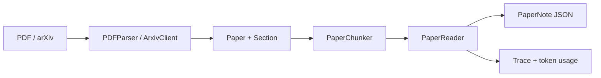

# P1 设计论证文档 — 从工程骨架到可验证的论文阅读链路

> **状态**：已完成
>
> **范围**：PDF/arXiv 输入、结构化论文模型、token-aware 分块、PaperReader、OpenAI-compatible Provider、PaperPipeline 与 CLI。
>
> **不在 P1 范围内**：P2 方法抽取和 P3 代码/实验已作为独立阶段完成；
> P4 核验、P5 记忆/知识图谱、P6 MCP/API/UI、
> P7 Guardrails 和 P8 Evaluation/Observability 仍在规划。

本文沿用 P0 文档的论证方式。每个决策都回答四个问题：**遇到了什么问题、有哪些备选方案、为什么做当前选择、选择带来了什么代价**。它既是技术评审材料，也是面试时解释 P1 工作的参考答案。

若要将文档中的设计映射到具体文件和可执行命令，请继续阅读
[P1 实现手册](P1-IMPLEMENTATION-GUIDE.md)；若只需要 API/环境变量速查，请看
[P1 技术参考](P1-TECHNICAL-REFERENCE.md)。

---

## 第一章 P1 的目标与交付边界

### 1.1 P0 留下的真实问题

P0 已经有 `BaseAgent` 的 ReAct 生命周期、Provider 数据契约和质量工具链，但用户还不能把一篇论文交给系统。缺少的不是又一个抽象类，而是一条可运行的数据链：

```text
PDF / arXiv ID
      ↓
PaperMetadata + Section + Paper
      ↓
PaperChunk（受 token 预算约束）
      ↓
PaperReader（工具调用、检索、阅读轨迹）
      ↓
PaperNote（TL;DR、贡献、方法摘要、结果、优缺点）
```

P1 的完成标准是这条链路能够被 Python API、离线测试和 CLI 独立验证，而不是声称已经完成端到端复现。

### 1.2 交付物与非交付物

| 交付物 | 当前状态 | 验收方式 |
|---|---:|---|
| `PDFParser` | 已完成 | 本地 PDF 解析测试 |
| `ArxivClient` | 已完成 | mock API、现代/旧式 ID 和真实查询 smoke test |
| `PaperChunker` | 已完成 | token 上限、长段落、空章节测试 |
| `PaperReader` | 已完成 | FakeLLM、native tool calls、强制总结、trace 测试 |
| OpenAI-compatible Provider | 已完成 | OpenAI/DeepSeek/本地 endpoint 配置与流式测试 |
| `PaperPipeline` | 已完成 | 解析、阅读、arXiv 下载组合测试 |
| CLI | 已完成 | `--version`、`capabilities`、`read-pdf`、`read-json` |
| Methodologist | 已实现 | 分属 P2，本页只说明 P1 输入边界 |
| 代码/实验/Verifier | 规划中 | 分属 P3/P4，不应描述为 P1/P2 已实现 |

---

## 第二章 为什么先做 Paper Reading，而不是完整复现

### 问题

代码生成和实验执行依赖方法、数据集、超参数和评价指标。如果 PDF 解析、章节边界和证据归因不稳定，后续 Agent 的错误将无法区分是“理解错了”还是“代码写错了”。

### 备选方案

1. 一开始实现六个 Agent 和完整编排；
2. 直接把整篇 PDF 文本塞进一次 LLM 请求；
3. 先实现单一、可测试的 PaperReader 垂直切片。

### 决策依据

选择第三种方案。它同时验证 P0 的三个核心抽象：`BaseAgent` 能否承载真实工具循环，`BaseProvider` 能否承载真实和 fake provider，以及领域模型能否被 API 与 CLI 复用。P1 交付的是一个可运行的最小闭环，而不是一张只有目录的“大架构图”。

### 代价认知

P1 的输出是阅读笔记，不是复现报告；它不能生成可信的训练代码，也不能证明论文指标已经复现。收窄范围使失败可定位、测试可重复，并为 P2 方法抽取提供稳定输入。

---

## 第三章 为什么使用 `Paper` / `Section` / `PaperChunk` 领域模型

### 问题

把 PDF 当作一个字符串会丢失章节名称、章节类型、页码范围和 token 估计。PaperReader 需要按章节读取，搜索结果也必须能回答“这句话来自哪一节”。

### 备选方案与选择

| 方案 | 优点 | 问题 |
|---|---|---|
| `str` 全文 | 最简单 | 无结构、难分块、难归因 |
| 通用 `Document` 列表 | 与普通 RAG 类似 | 论文元数据和章节语义不足 |
| Pydantic 领域模型 | 类型安全、可序列化、可扩展 | 初期模型数量更多 |

P1 选择 Pydantic 领域模型：

- `PaperMetadata` 保存标题、作者、arXiv ID、DOI、年份、URL 和摘要；
- `Section` 保存标题、`SectionType`、页码和 token 数；
- `Paper` 保存元数据、章节、全文、页数、总 token 数和来源；
- `PaperChunk` 是发给 Agent 的受预算约束上下文单元；
- `PaperNote` 是稳定的最终交付格式，可直接 JSON 序列化。

这使 PDF、arXiv、测试 fixture 和未来 LaTeX parser 可以共享同一条下游管道。

### 代价认知

章节检测不是完整的学术版式理解：双栏 PDF、扫描 PDF、非英文标题和复杂子章节可能被归为 `unknown` 或合并。P1 把它定位为保守的结构化抽取，而不是排版级 PDF 还原。

---

## 第四章 为什么 PDFParser 和 ArxivClient 使用惰性可选依赖

### 问题

核心类型、FakeLLM 测试和 `read-json` 不应因为用户没有安装 PyMuPDF 或 `arxiv` 就无法导入。把所有重量依赖放进核心安装会增加下载量，也会让离线测试失去意义。

### 决策

`PDFParser.parse()` 内部按需导入 `fitz`，`ArxivClient.__init__()` 内部按需导入 `arxiv`。缺少依赖时给出带安装命令的 `ImportError`，而不是在模块 import 阶段崩溃：

```text
uv sync --locked --extra pdf --group dev
uv sync --locked --extra arxiv --group dev
```

### 代价认知

错误会在第一次使用功能时出现，使用者需要理解 optional extra。这个代价换来了更小的核心环境和更清晰的能力边界；CLI 的 `capabilities` 命令也会把这些能力标成可选集成。

---

## 第五章 为什么使用 token-aware chunking

### 问题

固定字符数切割会破坏段落边界；只按章节切割又无法处理一个很长的 Method 章节。P1 需要简单、可解释、对 provider 无关的预算策略。

### 决策依据

`PaperChunker` 采用三级策略：

1. 尽可能把完整章节作为一个 chunk；
2. 多个小章节在 `max_tokens` 内合并，减少工具调用开销；
3. 超长章节按空行分段，超长单段再按空格边界做固定字符切分。

token 数优先使用解析器提供的 `Section.token_count`，同时用保守的 `ceil(len(text)/4)` 估计值兜底，避免错误的零值或过低 metadata 让 chunk 超预算。

### 代价认知

字符近似并不等于具体模型 tokenizer；中英文、公式和代码的真实 token 数可能不同。P1 的目标是安全预算和稳定测试，不是替代每个模型的精确 tokenizer。未来可以把 tokenizer 作为 `PaperChunker` 的可注入策略。

---

## 第六章 为什么 PaperReader 采用 ReAct + native tool calls

### 问题

摘要、引言、方法和实验通常必须阅读，但遇到术语或指标冲突时，Agent 还需要搜索全文或读取长章节的下一块。一次性总结会隐藏证据来源，也无法在 token 预算内渐进阅读。

### 决策依据

PaperReader 复用 P0 的 `BaseAgent` 生命周期，在每一步执行 `think → act → observe`：

- `list_sections`：先获取论文结构；
- `read_section(section_title, chunk_index)`：读取一个有边界的章节块；
- `search_paper(query)`：返回最多五个带章节标题的匹配片段；
- `finalize`：解析最终 JSON 并生成 `PaperNote`。

Provider 返回 native tool calls 时，PaperReader 保留 `tool_call_id` 并把工具结果以 `role=tool` 写回对话；旧式只返回文本时，仍保留保守的文本工具调用识别，兼容 FakeLLM 和简单 OpenAI-compatible 服务。

### 终止和失败策略

- 读到 `DONE` + JSON 时正常 finalize；
- 达到 `max_steps` 时关闭尚未执行的 parallel tool calls，并发送一次“只返回最终 JSON”的无工具总结请求；
- section 不存在、chunk 越界、参数类型错误会作为工具错误回写给模型；
- 没有可读章节或没有 Provider 时在发起 LLM 请求前抛出明确错误。

### 代价认知

ReAct 会产生多轮请求和额外 token 成本；文本回退识别不如 native tool calls 严格。P1 通过 `max_steps`、逐步 token usage、`reading_trace` 和 FakeLLM 测试控制风险。

---

## 第七章 为什么 Provider 使用 OpenAI-compatible 抽象

### 问题

PaperReader 只需要统一的 `LLMRequest`、`LLMResponse`、流式文本和工具调用。如果 Agent 代码直接依赖某家 SDK，切换 OpenAI、DeepSeek、Qwen、vLLM 或 Ollama 就会造成业务层重写。

### 决策依据

`OpenAIProvider` 把请求转为 chat completions 兼容协议，并统一返回：

- `content`、`model`、`finish_reason`；
- `prompt_tokens`、`completion_tokens`、`total_tokens`；
- `LLMToolCall(call_id, name, arguments)`；
- 异步 `generate_stream()` 文本迭代器。

环境变量解析有明确优先级：显式构造参数优先，其次是 `OPENAI_*`，再其次是原生 `DEEPSEEK_*`；仅有 DeepSeek key 时默认 `https://api.deepseek.com` + `deepseek-chat`。

### 为什么 DeepSeek 可以完成相同 P1 任务

DeepSeek 提供 OpenAI-compatible chat completions。P1 的 Provider 边界只依赖兼容请求和响应字段，因此不需要 OpenAI 专属能力即可完成 PaperReader 的工具调用与最终总结。CLI 优先读取 `OPENAI_API_KEY`，没有时读取 `DEEPSEEK_API_KEY`；本地兼容 endpoint 在无 key 时也可以运行。

### 代价认知

不同 provider 对工具调用、停止序列、上下文长度和 usage 字段的支持并不完全一致。P1 只承诺兼容协议层能力，不承诺所有模型拥有相同推理质量；真实 key、网络和模型配额仍是外部条件。

---

## 第八章 为什么 PaperPipeline 采用依赖注入

`PaperPipeline` 的 parser、arXiv client、reader 和 provider 都可以注入。这样做有三点价值：

1. 解析和阅读可以单独测试；
2. Fake provider 不会意外产生账单；
3. 未来增加 LaTeX parser、缓存 client 或其他 provider 时，不必修改编排逻辑。

调用 `read()` 而没有注入 reader/provider 时，pipeline 在第一次真实阅读前抛出 `ValueError`。arXiv client 则在调用搜索、查询或下载时才创建，保持可选依赖的惰性。

---

## 第九章 为什么 CLI 与 Python API 并存

Python API 适合 notebook、服务和测试，CLI 适合脚本、CI 和人工验证。P1 CLI 刻意保持小而明确：

```text
repro-forge --version
repro-forge capabilities
repro-forge read-pdf paper.pdf --output note.json
repro-forge read-json paper.json --output note.json
```

CLI 使用 `python-dotenv` 从当前目录 `.env` 加载配置且不覆盖已有进程环境变量；远程 endpoint 必须有 OpenAI/DeepSeek key，只有本地或私有网段的兼容 endpoint 才允许无 key。这避免把空 key 请求误发到公网。

---

## 第十章 P1 的工程质量与验证证据

当前基线（代码未改变时）为：

| 检查 | 结果 |
|---|---:|
| `uv run pytest -q` | 107 passed |
| 覆盖率 | 86.06% |
| Ruff format / lint | 通过 |
| `uv run mypy repro_forge` | 33 个源文件通过 |
| MkDocs clean build | 成功 |
| `uv build` | 成功 |
| 隔离 wheel CLI smoke test | 成功 |
| DeepSeek streaming smoke test | 成功 |
| 旧式 arXiv ID 真实查询 | 成功 |

这些证据证明 P1 的本地软件链路可验证；它们不等价于所有 PDF 版式、所有 provider 或论文复现结果都已验证。

---

## 第十一章 P1 与 P2–P8 的边界

### 当前实现



### 规划中的下一条链路

```text
PaperNote / Paper
  → Methodologist（P2）
  → CodeForger（P3）
  → Docker Experimentor（P3）
  → MathChecker / Verifier（P4）
  → Memory / KG / Survey（P5）
  → MCP / API / UI（P6）
  → Security / Guardrails（P7）
  → Evaluation / Observability（P8）
```

目录中已有的空包或未来文档是路线图占位，不是能力证明。技术评审时应以代码、测试和本文件的“交付物”表为准。

---

## 第十二章 面试话术

### 30 秒版本

> P1 把 P0 的 Agent 骨架变成了可运行的论文阅读闭环：PDF 或 arXiv 输入先转成带章节和页码的 Pydantic `Paper`，再用 token-aware chunker 控制上下文，PaperReader 通过 ReAct 工具调用按需读取和搜索，最后输出结构化 `PaperNote`。Provider 采用 OpenAI-compatible 边界，所以 DeepSeek、OpenAI 和本地服务可以替换；方法抽取、代码生成和实验执行分别留到 P2、P3，结果核验留到 P4。

### 2 分钟版本

> 关键设计有三点。第一，领域模型把元数据、章节、chunk 和 note 分开，避免全文字符串导致的上下文和证据问题。第二，PaperReader 不把整篇论文一次性塞给模型，而是通过 list_sections、read_section 和 search_paper 逐步读取；native tool calls、文本回退、step budget 和强制最终总结共同保证可恢复性。第三，Provider 和 Pipeline 都采用依赖注入，测试中使用 FakeLLMProvider，真实环境可以通过 OPENAI_* 或 DEEPSEEK_* 切换。最终 107 个测试通过、覆盖率 86.06%，并完成 mypy、Ruff、构建和 DeepSeek smoke test。

### 深挖追问

- **为什么不直接用 LangChain？** P1 的重点是论文领域模型和可观测 ReAct 状态；后续仍可在边界层集成框架。
- **如何避免长章节超上下文？** 章节优先、段落次之、超长段落按空格切分，并用保守 token 估计兜底。
- **LLM 工具调用失败怎么办？** 参数校验和错误 observation 回写对话；达到步数上限时清理 pending calls，再请求无工具最终总结。
- **DeepSeek 是否需要改 Agent 代码？** 不需要，使用同一 OpenAI-compatible wire contract；只改变 key、base URL 和 model。
- **P1 是否已经能复现论文？** 不能。P1 只提供可靠的阅读事实层，Methodologist、代码、执行和 Verifier 属于后续阶段。

P1 之后的已完成阶段见 [P2 实施规划](P2-IMPLEMENTATION-PLAN.md)：P2 只交付
带证据归因的 Methodologist/`MethodAnalysis`，知识图谱写入保留到 P5。
