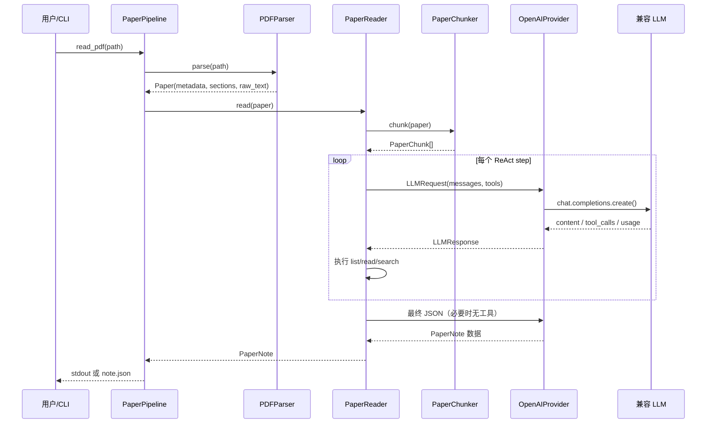
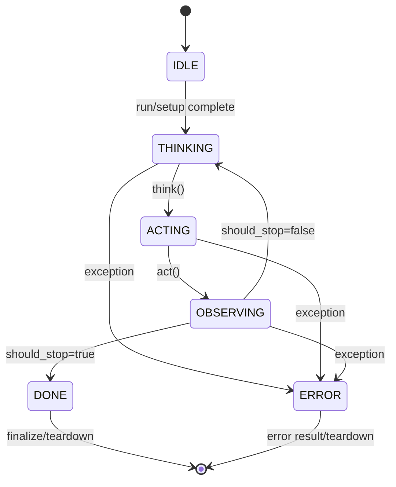

# P1 实现手册 — 从输入论文到可追踪阅读笔记

> 本文面向需要阅读代码、复现本地运行、排查问题或继续开发的工程师。
> 它补充两份 P1 核心文档：
>
> - [P1 设计论证](P1-DESIGN-RATIONALE.md)：解释为什么这样设计；
> - [P1 技术参考](P1-TECHNICAL-REFERENCE.md)：列出 API、命令和配置速查。
>
> 本文只描述已经存在的 P1 代码。Methodologist、代码生成、实验执行、长期记忆、知识图谱、MCP、HTTP API 和前端仍属于 P2+ 规划。

---

## 1. 阅读本项目的正确顺序

推荐按下面的依赖方向阅读，而不是从“六 Agent”路线图开始：

```text
repro_forge/core/types.py
        ↓
repro_forge/core/base.py
        ↓
repro_forge/providers/base.py
        ↓
repro_forge/paper/schemas.py
        ↓
PDFParser / ArxivClient / PaperChunker
        ↓
PaperReader
        ↓
PaperPipeline / CLI
```

每一层只解决一个问题：

| 层 | 需要回答的问题 | 主要文件 |
|---|---|---|
| P0 类型 | 消息、动作、观察、任务和 trace 如何表示？ | `core/types.py` |
| P0 运行时 | Agent 如何循环、停止、失败和记录 trace？ | `core/base.py` |
| Provider | LLM 请求、响应、工具调用如何统一？ | `providers/base.py` |
| 领域模型 | 论文、章节、chunk、阅读笔记如何序列化？ | `paper/schemas.py` |
| 输入适配 | PDF 和 arXiv 如何转换成 `Paper`？ | `paper/parser/` |
| 上下文控制 | 长论文如何切成模型可读的块？ | `paper/chunker.py` |
| Agent | 模型如何选择章节、搜索和最终总结？ | `agents/paper_reader.py` |
| 编排 | 如何把解析、下载和阅读组合起来？ | `paper/pipeline.py` |
| 用户入口 | 如何从 shell 调用？ | `cli.py` |

---

## 2. 一次完整运行的时序

### 2.1 本地 PDF



### 2.2 arXiv

```text
read_arxiv(id, output_dir)
  1. normalize_arxiv_id(id)
  2. ArxivClient.fetch/download
  3. 得到 output_dir/<safe-id>.pdf
  4. 复用 read_pdf()
  5. 返回 PaperNote
```

下载与阅读是两个阶段：下载成功不代表 PDF 一定能解析，解析成功也不代表 LLM 一定能总结。排障时要先判断失败发生在哪一层。

---

## 3. 数据契约详解

### 3.1 `SectionType`

`SectionType` 是 `StrEnum`，因此既可以按枚举比较，也可以按字符串序列化：

```python
from repro_forge.paper import SectionType

assert SectionType.METHOD.value == "method"
```

当前值及其用途：

| 值 | 典型标题 | 下游用途 |
|---|---|---|
| `abstract` | Abstract | 阅读第一步、TL;DR 证据 |
| `introduction` | Introduction | 背景和贡献 |
| `related_work` | Related Work / Background | 研究定位 |
| `method` | Method / Approach / Model | 技术方法 |
| `experiments` | Experiments / Evaluation / Setup | 实验设置 |
| `results` | Results / Performance | 指标结果 |
| `discussion` | Discussion / Analysis | 局限与解释 |
| `conclusion` | Conclusion / Future Work | 总结 |
| `appendix` | Appendix / Supplementary | 补充细节 |
| `references` | References | 引用区，不建议作为主要阅读上下文 |
| `unknown` | 未识别标题或前言 | 保留原文，不丢数据 |

### 3.2 `PaperMetadata`

```python
PaperMetadata(
    title="Attention Is All You Need",
    authors=["Ashish Vaswani"],
    arxiv_id="1706.03762",
    doi="",
    year=2017,
    venue="arXiv",
    url="https://arxiv.org/abs/1706.03762",
    abstract="...",
)
```

所有字段都有默认值，原因是 PDF info 字典、arXiv 记录和人工构造 fixture 的完整程度不同。不要把空 `doi` 或空 `year` 当成解析失败；应结合 `source`、`sections` 和 `raw_text` 判断。

### 3.3 `Section`

| 字段 | 类型 | 语义 |
|---|---|---|
| `title` | `str` | 从 PDF 标题行或人工输入得到的标题 |
| `content` | `str` | 不含标题行的正文 |
| `section_type` | `SectionType` | 规则识别的标准类别 |
| `page_start` | `int` | 起始页，当前从 1 开始 |
| `page_end` | `int` | 结束页，包含结束页 |
| `token_count` | `int` | 解析阶段的近似 token 数 |

`token_count` 是 metadata，不是模型 tokenizer 的精确结果。`PaperChunker` 会对它做保守兜底。

### 3.4 `Paper`

`Paper` 是所有输入适配器的共同输出：

```python
paper.metadata       # PaperMetadata
paper.sections       # list[Section]
paper.raw_text       # 全文
paper.total_pages    # PDF 页数；人工构造时可为 0
paper.total_tokens   # 章节 token_count 之和
paper.source         # 绝对路径或其他来源标识
```

三个便捷属性：

```python
paper.abstract_section  # Section | None
paper.method_sections    # list[Section]
paper.section_titles     # list[str]
```

### 3.5 `PaperChunk`

`PaperChunk` 只负责“发送给 Agent 的有界上下文”，不替代原始 `Section`。其中：

- `chunk_index` 是整篇 `Paper` 生成的全局索引；
- `section_title` 用于搜索归因和续读；
- `token_count` 是当前 chunk 的估计值；
- `text` 可能带 `## Section` 或 `(continued)` 提示。

不要使用全局 `chunk_index` 直接当作 `read_section` 的参数。工具参数是“某个章节内部的零基编号”。

### 3.6 `PaperNote`

最终输出的最小稳定结构如下：

```json
{
  "paper_id": "1706.03762",
  "arxiv_id": "1706.03762",
  "title": "Attention Is All You Need",
  "tldr": "...",
  "contributions": [
    {
      "description": "...",
      "confidence": 0.9,
      "supporting_sections": ["Introduction", "Method"]
    }
  ],
  "methodology_summary": "...",
  "key_findings": [
    {
      "description": "...",
      "metric_name": "BLEU",
      "metric_value": "28.4",
      "dataset": "WMT 2014 En-De"
    }
  ],
  "section_notes": {},
  "strengths": [],
  "weaknesses": [],
  "questions": [],
  "reading_trace": ["Abstract", "Method"],
  "total_tokens_used": 1234,
  "created_at": "2026-08-05T00:00:00+00:00"
}
```

模型输出字段不完整时，`PaperNote` 的默认值允许生成可序列化结果；字段类型错误仍应在构造时暴露，而不是静默生成错误报告。

---

## 4. PDFParser 实现细节

### 4.1 解析阶段

`PDFParser.parse()` 的实际顺序是：

1. 在函数内部导入 `fitz`；
2. 检查 `Path(file_path).exists()`；
3. `fitz.open()` 打开文档；
4. 从 `doc.metadata` 读取 title/author；
5. 逐页调用 `page.get_text()`；
6. 将所有页面文本交给 `_detect_sections()`；
7. 创建 `Paper` 并汇总 `total_tokens`；
8. 在 `finally` 中关闭 PDF 文档。

因此，资源关闭不会因为章节检测异常而被跳过。

### 4.2 标题识别规则

标题识别同时满足：

- 去除首尾空白后长度不超过 60；
- 不以 `. ? ! ;` 结束，避免把正文句子当标题；
- 匹配大小写不敏感的常见英文模式；
- 可选数字前缀，例如 `2. Method` 或 `3 Experiments`。

解析器是“标题模式识别器”，不是视觉版式模型。以下输入可能需要人工预处理：扫描图片 PDF、复杂双栏布局、中文或自定义标题、表格/公式占据大部分页面。

### 4.3 解析结果检查

```python
paper = PDFParser().parse("paper.pdf")

if not paper.raw_text.strip():
    raise RuntimeError("PDF has no extractable text; run OCR or inspect the file")

for section in paper.sections:
    print(section.title, section.section_type, section.page_start, section.page_end)
```

排查时优先检查：

1. `paper.total_pages > 0`；
2. `paper.raw_text` 非空；
3. `paper.sections` 非空；
4. `section.content` 是否含预期文字；
5. 标题是否大量为 `Preamble`/`unknown`。

---

## 5. PaperChunker 实现细节

### 5.1 主循环

```text
过滤空章节
  ↓
取 max(section.token_count, ceil(len(content)/4))
  ↓
能放入 buffer？ ── 是 → 合并
  │
  否
  ↓
flush buffer
  ↓
章节未超预算？ ── 是 → 独立 chunk
  │
  否
  ↓
按段落拆分；单段仍超预算时按字符/空格拆分
```

### 5.2 参数建议

| 场景 | `max_tokens` 建议 | 说明 |
|---|---:|---|
| 单元测试 | 100–500 | 快速覆盖合并和切分分支 |
| 普通阅读 | 4000 | 当前 PaperReader 默认值 |
| 小上下文本地模型 | 1000–2000 | 减少单次工具结果大小 |
| 需要更完整证据 | 4000–8000 | 仍受 provider 上下文限制 |

`min_tokens` 当前保留为构造配置，但主策略的硬约束是 `max_tokens`；不要把 `min_tokens` 误解为每个 chunk 的最小长度保证。

### 5.3 分块验收

```python
chunks = PaperChunker(max_tokens=4000).chunk(paper)
assert chunks
assert all(chunk.text.strip() for chunk in chunks)
assert all(chunk.token_count > 0 for chunk in chunks)
assert [c.chunk_index for c in chunks] == list(range(len(chunks)))
```

长章节需要额外检查 `continued` 提示和相邻 chunk 是否覆盖全文；固定字符分割只在单个段落本身超过预算时触发。

---

## 6. PaperReader 状态机和工具协议

### 6.1 `BaseAgent` 状态机



`run()` 每步最多执行一次 think、act、observe，并将三者封装进 `TraceStep`。循环上限是 `min(config.max_steps, task.max_steps)`。

### 6.2 `PaperReader` 初始化

`PaperReader.read(paper)` 会：

1. 建立 `PaperChunker(max_tokens=4000)`；
2. 在没有 Provider 时立即失败；
3. 对论文分块；
4. 在没有可读 chunk 时立即失败；
5. 创建 `TaskSpec`；
6. 调用继承自 `BaseAgent` 的 `run()`；
7. 把每步 usage 写回 trace；
8. 把最终数据转换为 `PaperNote`，补充 title、arXiv ID、reading trace 和总 token。

### 6.3 工具参数契约

#### `list_sections`

```json
{"name": "list_sections", "arguments": {}}
```

返回去重后的标题列表。它不返回正文，目的是帮助模型先规划阅读路径。

#### `read_section`

```json
{
  "name": "read_section",
  "arguments": {"section_title": "Method", "chunk_index": 0}
}
```

校验规则：`section_title` 必须是非空字符串；`chunk_index` 必须是非负整数且不能是布尔值。标题先精确匹配，再做包含匹配。未知标题、章节内 chunk 越界会返回带可用标题/范围的工具错误。

长章节返回：

```text
Section 'Method', chunk 1 of 3:
...

Continue with read_section(section_title='Method', chunk_index=1).
```

#### `search_paper`

```json
{"name": "search_paper", "arguments": {"query": "BLEU"}}
```

搜索是不区分大小写的子串匹配，返回最多五个片段，并使用 `[Section Title]` 保留来源。它不是向量检索，也不做同义词扩展。

### 6.4 Native call 与文本回退

优先路径：

```text
LLMResponse.tool_calls
  → LLMToolCall
  → Action
  → Observation
  → role=tool message
```

兼容路径：

```text
LLMResponse.content
  → _detect_tool_call()
  → Action
  → 合成 assistant tool_calls
  → Observation
```

文本回退支持有限的关键词模式。不要把它当作通用自然语言解析器；生产 provider 应优先支持原生工具调用。

### 6.5 结束和强制总结

正常结束需要模型输出 `DONE` 和 JSON。若达到步数预算仍没有最终 JSON：

1. 把未执行的 pending native calls 写成 skipped tool messages；
2. 追加“不要调用工具，只返回最终 JSON”的 user message；
3. 发起一次不带 tools/tool_choice 的请求；
4. 从 markdown code fence 或大括号中提取 JSON；
5. 构造 `TaskResult` 和 `PaperNote`。

这是一种保底策略，不等于保证模型输出一定符合 schema；非 JSON 内容会退化为截断的 `tldr`。

---

## 7. Provider 配置、请求和响应

### 7.1 请求字段

| 字段 | 来源 | P1 用途 |
|---|---|---|
| `messages` | PaperReader conversation | system/user/assistant/tool 对话 |
| `model` | `AgentConfig.model` 或 Provider 默认 | 选择模型 |
| `temperature` | `AgentConfig.temperature` | P1 默认 0.0 |
| `max_tokens` | PaperReader 固定 2048 | 单次回答预算 |
| `tools` | `PAPER_READER_TOOLS` | native tool schema |
| `tool_choice` | `auto` 或最终总结时为空 | 工具选择策略 |
| `stop_sequences` | 调用方提供 | 透传给兼容服务 |

### 7.2 环境变量解析矩阵

| `OPENAI_API_KEY` | `DEEPSEEK_API_KEY` | endpoint | 结果 |
|---|---|---|---|
| 有 | 任意 | `OPENAI_BASE_URL` | OpenAI key + OpenAI model/base URL |
| 无 | 有 | `DEEPSEEK_BASE_URL` 或默认 | DeepSeek key + `deepseek-chat` |
| 无 | 无 | localhost/私网 `OPENAI_BASE_URL` | placeholder key，允许 keyless |
| 无 | 无 | 公网 endpoint 或无 endpoint | CLI 拒绝，避免匿名公网请求 |

直接构造 Provider 时，`api_key`、`base_url`、`model` 参数优先于环境变量。显式 `api_key` 但没有 base URL 时，会读取 `OPENAI_BASE_URL` 或 `DEEPSEEK_BASE_URL`，最终仍使用 `gpt-4o`/环境模型兜底。

### 7.3 响应归一化

Provider 从 SDK response 提取：

```python
LLMResponse(
    content="...",
    model="deepseek-chat",
    finish_reason="stop",
    usage={
        "prompt_tokens": 100,
        "completion_tokens": 40,
        "total_tokens": 140,
    },
    tool_calls=[LLMToolCall(...)],
    raw=response,
)
```

工具 arguments 先尝试 JSON 解析；解析失败或结果不是 object 时降级为空字典。真实 provider 的差异被限制在 Provider 边界，不向 PaperReader 泄漏 SDK 类型。

---

## 8. CLI 行为和退出路径

### 8.1 命令分发

| 命令 | 内部入口 | 说明 |
|---|---|---|
| `--version` | argparse action | 直接打印包版本 |
| `capabilities` | `_capabilities` | 打印 P1 已实现能力 |
| `read-pdf` | `_read_pdf` | 构造 Provider 后调用 `read_pdf` |
| `read-json` | `_read_json` | 校验 Paper JSON 后调用 `read` |
| 无命令 | `_capabilities` | 默认打印能力列表 |

### 8.2 `.env` 读取规则

CLI 在 `Path.cwd() / ".env"` 加载 dotenv，`override=False`。因此：

```text
进程环境变量 > 当前目录 .env > 代码默认值
```

`.env` 不会自动从项目根目录向上搜索；从其他目录执行 CLI 时，应显式设置环境变量，或在当前目录放置 `.env`。

### 8.3 输出文件

`--output` 使用 UTF-8、`ensure_ascii=False`、两空格缩进，并追加换行。父目录不会自动创建；如果目标目录不存在，文件写入会失败，应提前创建目录。

```powershell
New-Item -ItemType Directory -Force data\notes | Out-Null
uv run repro-forge read-pdf paper.pdf --output data\notes\note.json
```

### 8.4 CLI 前置检查

```powershell
uv run repro-forge capabilities
uv run repro-forge --version
python -c "import os; print(bool(os.getenv('DEEPSEEK_API_KEY')))"
```

不要在 shell 输出、日志或 issue 中粘贴完整 API key。

---

## 9. 注入式扩展方式

### 9.1 注入自定义 parser

只需满足 `PaperParser` Protocol：

```python
class MarkdownParser:
    def parse(self, file_path: str | Path) -> Paper:
        return Paper(...)

pipeline = PaperPipeline(
    provider=fake_provider,
    parser=MarkdownParser(),
)
```

Parser 不需要继承具体基类，关键是拥有 `parse(file_path) -> Paper` 方法。

### 9.2 注入 arXiv fake client

测试可以避免网络：

```python
class FakeArxiv:
    def search(self, query: str, max_results: int = 10) -> list[PaperMetadata]:
        return [PaperMetadata(title="Fixture", arxiv_id="1234.5678")]

    def fetch_by_id(self, arxiv_id: str) -> PaperMetadata | None:
        return PaperMetadata(title="Fixture", arxiv_id=arxiv_id)

    def download_pdf(self, arxiv_id: str, output_dir: str | Path = ".") -> Path:
        return Path(output_dir) / "fixture.pdf"
```

### 9.3 注入 Provider

Provider 必须实现 `generate()`、`generate_stream()` 和 `provider_name`。测试 Provider 应记录 request，才能断言模型是否带 tools、是否在强制总结时移除 tools。

### 9.4 继承 `BaseAgent`

自定义 Agent 需要实现五个 hook：`think`、`act`、`observe`、`should_stop`、`finalize`。不要在子类中复制 `run()` 循环；统一生命周期、状态和 trace 是 P0 设计的可观测基础。

---

## 10. 测试矩阵与验收清单

### 10.1 单元测试矩阵

| 风险 | 测试文件 | 最小断言 |
|---|---|---|
| 标题误识别 | `test_pdf_parser.py` | 正常标题识别、正文句子不识别 |
| 资源未关闭 | `test_pdf_parser.py` | 异常路径仍 close |
| arXiv ID 变体 | `test_arxiv_api.py` | modern/legacy/url/pdf 输入统一 |
| 路径穿越/目录错误 | `test_arxiv_api.py` | `/`、`\` 被安全替换 |
| chunk 超预算 | `test_chunker.py` | 长段落切分、索引连续 |
| 空输入 | `test_chunker.py` | 返回空列表而非伪造 chunk |
| 工具参数错误 | `test_paper_reader.py` | `Observation.is_error` 和 tool message |
| native parallel calls | `test_paper_reader.py` | call id 对齐、pending call 清理 |
| 最终 JSON | `test_paper_reader.py` | fenced JSON、普通 JSON、退化 tldr |
| Provider 优先级 | `test_openai_provider.py` | OpenAI/DeepSeek/显式参数 |
| keyless 安全边界 | `test_cli.py` | 本地允许、公网拒绝 |
| 编排注入 | `test_pipeline.py` | fake parser/client/reader 被调用 |

### 10.2 发布前命令

```powershell
uv run pytest -q
uv run ruff check repro_forge tests
uv run ruff format --check repro_forge tests
uv run mypy repro_forge
uv run mkdocs build --clean -f docs/mkdocs.yml
uv build
git diff --check
```

### 10.3 人工 smoke test

```powershell
uv run repro-forge --version
uv run repro-forge capabilities
uv run python examples/read_paper.py
```

真实 DeepSeek smoke test：

```powershell
uv sync --locked --extra pdf --extra openai --group dev
$env:DEEPSEEK_API_KEY = "..."
uv run repro-forge read-pdf .\paper.pdf --output .\note.json
Get-Content .\note.json -Encoding utf8 | Select-Object -First 30
```

### 10.4 验收标准

P1 可宣布“完成”至少需要：

- 核心 API 在无 key 环境可 import；
- 离线示例不访问网络且输出 `PaperNote`；
- PDF/arXiv extra 缺失时给出明确安装提示；
- 长章节不会因为错误 token metadata 直接取消分块；
- 工具错误能回写对话并保留 call id；
- 步数耗尽仍能尝试最终总结；
- OpenAI、DeepSeek、keyless local endpoint 的配置边界清楚；
- 测试、静态检查、文档构建和包构建均通过；
- 文档不把 P2+ 空包、compose 模板和架构图当作已实现功能。

---

## 11. 故障定位决策树

```text
命令启动失败
  ├─ import error → 检查对应 extra 和 uv 环境
  ├─ 缺少 key → 检查 OPENAI/DEEPSEEK 变量与 endpoint
  ├─ PDF file not found → 检查当前目录和绝对路径
  ├─ PDF 无文本 → 检查扫描件/OCR/文件是否有效
  ├─ sections 为空 → 检查标题格式和抽取文本
  ├─ section not found → 先 list_sections，再使用返回标题
  ├─ chunk 越界 → 从 0 开始，按续读提示递增
  ├─ provider HTTP error → 检查 base URL、model、额度、网络
  ├─ JSON 解析失败 → 检查模型是否支持 tools/按要求输出 JSON
  └─ 输出文件失败 → 先创建父目录并确认写权限
```

将问题按层隔离：先用 `PaperParser` 验证输入，再用 Fake Provider 验证 Reader，最后才接入真实网络 Provider。不要用真实 API 同时排查 PDF、chunk 和 prompt 问题。

---

## 12. 已知限制与后续演进

### 当前限制

1. PDF 解析没有 OCR，也没有视觉布局模型；
2. 章节识别依赖常见英文标题模式；
3. token 统计是保守近似，不等于 provider tokenizer；
4. `search_paper` 是大小写不敏感子串搜索，不是向量检索；
5. PaperReader 的文本工具调用回退是启发式；
6. 流式接口只 yield 文本片段，不提供统一 usage 回调；
7. 真实 provider 的网络、配额、工具调用能力和输出质量不受本地测试完全覆盖；
8. P1 输出阅读笔记，不做算法正确性、代码正确性或实验指标判断。

### 后续演进原则

- 新 parser 继续输出 `Paper`，不要让下游依赖 PDF 专属对象；
- 新 tokenizer 作为 chunker 策略注入，不修改 `PaperChunk` 契约；
- 新 provider 适配 `BaseProvider`，不要在 Agent 中分支判断厂商；
- 新 Agent 复用 `BaseAgent` trace 和状态，不复制循环；
- P2+ 功能只有在代码、测试、配置和文档同时具备时，才能从“规划”改为“已完成”。
