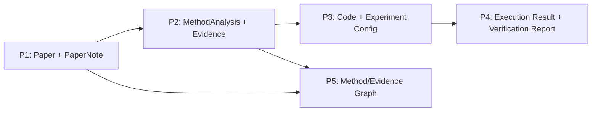

# P2 实施规划 — Evidence-Grounded Methodology Extraction

> **状态**：`Planned`（规划完成，尚未开始实现）
>
> **更新时间**：2026-08-05
>
> **前置条件**：P0 核心运行时和 P1 论文阅读链路已完成并通过当前质量基线
>
> **P2 核心目标**：实现 Methodologist，将 `Paper` 与可选 `PaperNote` 转换为带原文证据的方法学结构 `MethodAnalysis`

本文是 P2 的执行依据。文中的类、模块、命令和 schema 均为**计划新增**，在代码、测试和文档全部完成前不得标记为可用。

---

## 1. 本次规划更新的关键决策

### 1.1 P2 聚焦方法学抽取

P2 的交付边界调整为：

```text
Paper + optional PaperNote
        ↓
Methodologist
        ↓
Evidence-grounded MethodAnalysis
```

P2 不直接生成训练代码，不运行实验，也不写入知识图谱。

### 1.2 知识图谱写入移到 P5

旧 README 将 “KG writes” 放在 P2，但现有路线图将 Knowledge Graph 放在 P5。更新后采用后者：

- P2 只定义稳定、可序列化的 `MethodAnalysis`；
- P3 使用它生成代码和实验配置；
- P5 再将论文、方法、数据集、指标和证据关系写入知识图谱。

这样可以避免在方法 schema 尚未稳定时提前绑定 Neo4j 数据模型。

### 1.3 证据优先于“抽取字段越多越好”

P2 的核心质量标准不是模型生成了多少字段，而是每个关键结论能否追溯到论文章节和原文片段。无法从论文确认的配置必须标记为 `not_reported` 或 `inferred`，不能伪装成论文明确报告的事实。

---

## 2. P2 目标、交付物和非目标

### 2.1 目标

1. 从论文中抽取研究问题、核心算法、模型架构、训练配置和评价协议；
2. 为算法步骤、超参数、数据集和指标声明提供章节/页码/原文证据；
3. 区分论文明确报告、合理推断、冲突信息和未报告信息；
4. 输出 Pydantic 校验、JSON 可序列化的 `MethodAnalysis`；
5. 复用 P0 Agent/Provider 和 P1 Paper/Chunk/Pipeline，不破坏现有接口；
6. 提供离线确定性测试、Python API、CLI 和 DeepSeek smoke test。

### 2.2 计划交付物

| 交付物 | 计划路径 | 作用 |
|---|---|---|
| 方法学 schema | `repro_forge/paper/extractor/schemas.py` | 定义证据、算法、架构、训练和评价结构 |
| 证据索引/校验 | `repro_forge/paper/extractor/evidence.py` | 章节读取、搜索、quote 归一化和本地校验 |
| Methodologist | `repro_forge/agents/methodologist.py` | ReAct 方法学抽取 Agent |
| 方法学 pipeline | `repro_forge/paper/extractor/pipeline.py` | 组合 P1 pipeline 与 Methodologist |
| 公共导出 | `agents/__init__.py`、`paper/extractor/__init__.py` | 稳定 import 路径 |
| CLI | `analyze-pdf`、`analyze-json` | 输出 `MethodAnalysis` JSON |
| 单元/集成测试 | `tests/unit/`、`tests/integration/` | 无网络验证所有关键分支 |
| P2 文档 | 设计论证、技术参考、用户指南 | 说明边界、API、配置和验证证据 |

### 2.3 明确非目标

| 不属于 P2 | 所属阶段/原因 |
|---|---|
| PyTorch/TensorFlow 代码生成 | P3 CodeForger |
| Docker 训练与评估 | P3 Experimentor |
| 数学推导正确性证明 | P4 MathChecker |
| 复现指标对比与报告 | P4 Verifier |
| ChromaDB/长期记忆 | 后续基础设施阶段 |
| Neo4j/知识图谱写入 | P5 |
| SurveyScribe | P5 |
| MCP、FastAPI、前端 | P6 |
| Guardrails 平台 | P7 |
| 完整 benchmark/observability 平台 | P8 |

P2 可以保留 trace、token usage 和 evidence coverage 等局部指标，但不能把它们描述成 P8 的完整可观测/评测系统。

---

## 3. P1 输入和 P3 输出边界

### 3.1 P2 接收的输入

```python
await methodologist.analyze(
    paper: Paper,
    paper_note: PaperNote | None = None,
) -> MethodAnalysis
```

- `Paper` 是必需输入，因为证据必须回到原文章节；
- `PaperNote` 是可选提示，只用于提供摘要、贡献和阅读线索；
- `PaperNote` 不能替代原文，也不能作为唯一证据来源；
- arXiv/PDF 下载和解析继续复用 P1 `PaperPipeline`。

### 3.2 P2 产出的下游契约

P3 CodeForger 应只依赖公开的 `MethodAnalysis`，而不是读取 Methodologist 的 prompt、conversation 或私有 trace。这样 P2 的 Agent 策略可以调整，而 P3 的输入契约保持稳定。

```text
MethodAnalysis
├── problem_statement
├── algorithms[]
├── architecture
├── training_recipe
├── evaluation_protocol
├── equations[]
├── reported_claims[]
├── assumptions[]
├── reproducibility_gaps[]
├── evidence_coverage
└── extraction_trace / token usage
```

---

## 4. 计划数据模型

以下字段是实现阶段的初始契约。编码前先通过 schema tests 固化 JSON 结构。

### 4.1 `EvidenceStatus`

```text
verified      原文中可定位到匹配证据
inferred      模型推断，论文没有直接陈述
conflicting   论文不同位置存在冲突
not_reported  论文未报告
unverified    提供了引用但本地无法匹配
```

P2 输出必须保留状态，不能把 `inferred` 或 `unverified` 自动提升为 `verified`。

### 4.2 `EvidenceRef`

| 字段 | 类型 | 说明 |
|---|---|---|
| `evidence_id` | `str` | 在本次 `MethodAnalysis` 内稳定的引用 ID |
| `paper_id` | `str` | 与输入 `Paper` 一致的论文身份 |
| `source_hash` | `str` | 证据来源内容哈希，防止引用到另一版 PDF |
| `section_id` | `str` | 稳定章节 ID；标题只是显示字段 |
| `section_title` | `str` | 证据章节标题 |
| `page_start` | `int | None` | 1-based 起始页；未知时为 `None` |
| `page_end` | `int | None` | 1-based 结束页；未知时为 `None` |
| `quote` | `str` | 尽可能短的原文片段 |
| `quote_hash` | `str` | 对归一化 quote 的哈希，供 P5 provenance 使用 |
| `chunk_index` | `int | None` | 长章节中的章节内 chunk 编号 |
| `status` | `EvidenceStatus` | 本地校验/推断状态 |
| `confidence` | `float` | 0–1，表示抽取置信度而非事实概率 |

本地校验至少应执行：paper/source hash 匹配、section ID 匹配、空 quote 拒绝、
空白归一化后的子串匹配。PDF 换行连字符可以做受控去连字符处理，但不能使用
模糊匹配把完全不同的句子判为 verified。`verified` 只表示**证据位置已验证**，
不表示该论文声明本身已经被实验或数学证明。

P1 `Paper/Section` 当前没有 hash/section ID，P2 不为此破坏 P1 schema：
`PaperEvidenceView` 对 canonical `Paper` 内容计算 `source_hash`，并按章节顺序、
标题和内容 hash 生成 deterministic `section_id`；P1 的页码 `0` 在 P2 边界转换为
`None`。如果上游另有原始 PDF hash，可作为额外 provenance 字段保存，但不能与
canonical Paper hash 混用。

### 4.3 `EquationEvidence`

P4 MathChecker 不能凭 `AlgorithmStep.equations` 的自由文本建立可靠输入，因此 P2
必须额外交付结构化但不夸大解析能力的公式证据：

| 字段 | 说明 |
|---|---|
| `equation_id` | MethodAnalysis 内稳定 ID |
| `label` | 论文公式编号；没有时为 `None` |
| `raw_text` | P1/P2 实际捕获的文本或 LaTeX；不得由模型补写 |
| `normalized_text` | 可选规范化形式；必须保留 raw |
| `parse_status` | `captured/partial/not_available` |
| `symbol_hints` | 仅作 P4 建立符号表的候选，不视为验证结果 |
| `evidence` | 公式所在章节/页码/来源哈希 |

如果 PDF 文本层没有保留公式，输出 `not_available` 和对应 gap；不能让模型根据
上下文重建公式后标成原文。未来可靠 LaTeX/source parser 可以增加新 producer，
但必须保留 producer/version 和原始来源。

### 4.4 `ReportedClaimDraft`

P4 不应重新从自由文本猜论文声称值。P2 计划输出 claim draft：dataset、split、
metric、reported value/raw text、unit/scale、direction、aggregation、evaluation
setting、uncertainty、evidence 和 status。数值归一化与可比性 verdict 属于 P4；
P2 保留论文原始表达，无法确认的单位或 split 显式标记。

### 4.5 `AlgorithmStep`

| 字段 | 说明 |
|---|---|
| `order` | 步骤序号，从 1 开始 |
| `description` | 自然语言步骤 |
| `inputs` / `outputs` | 当前步骤的数据依赖 |
| `equations` | 论文中明确出现的公式文本或编号 |
| `evidence` | 一个或多个 `EvidenceRef` |

### 4.6 `AlgorithmSpec`

| 字段 | 说明 |
|---|---|
| `name` | 算法/方法名称 |
| `purpose` | 解决的问题 |
| `inputs` / `outputs` | 方法级输入输出 |
| `steps` | 有序 `AlgorithmStep` |
| `pseudocode` | 面向实现的伪代码，不是可执行代码 |
| `assumptions` | 数据、模型或理论假设 |
| `complexity_notes` | 论文报告的复杂度；未报告时显式标记 |
| `evidence` | 方法级证据 |

### 4.7 `ArchitectureComponent`

| 字段 | 说明 |
|---|---|
| `name` | 组件名称 |
| `component_type` | encoder、decoder、attention、loss 等 |
| `description` | 功能和连接关系 |
| `input_shape` / `output_shape` | 论文明确报告时填写 |
| `parameters` | 层数、维度、激活等结构参数 |
| `evidence` | 原文章节和 quote |

### 4.8 `TrainingRecipe`

计划字段包括：

- datasets / splits；
- preprocessing / augmentation；
- objective / loss；
- optimizer；
- learning-rate schedule；
- batch size / epochs / steps；
- initialization / regularization；
- hardware / precision / distributed setup；
- random seeds；
- reported-but-ambiguous fields；
- evidence per value。

每个关键配置使用“值 + 状态 + evidence”的结构，而不是普通字符串字典，以便区分未报告和抽取失败。

### 4.9 `EvaluationProtocol`

包括数据集、split、metric、baseline 和 evaluation procedure，并通过
`reported_claims[]` 引用结构化 claim draft。P2 只抽取论文如何评估，不判断结果
是否正确，也不运行评估。

### 4.10 `ReproducibilityGap`

| 字段 | 说明 |
|---|---|
| `category` | data/config/code/metric/compute/ambiguity |
| `description` | 缺失或矛盾内容 |
| `impact` | 对复现的预期影响 |
| `related_sections` | 涉及章节 |
| `suggested_resolution` | 需要查代码、附录或联系作者等建议 |

### 4.11 `MethodAnalysis`

这是 P2 唯一稳定的顶层输出：

```python
MethodAnalysis(
    paper_id="1706.03762",
    title="Attention Is All You Need",
    problem_statement="...",
    algorithms=[...],
    architecture=[...],
    training_recipe=...,
    evaluation_protocol=...,
    equations=[...],
    reported_claims=[...],
    assumptions=[...],
    reproducibility_gaps=[...],
    evidence_coverage=0.86,
    total_tokens_used=0,
    extraction_trace=[],
)
```

`evidence_coverage` 的计算规则必须在代码中确定，例如“要求证据的非空声明中，至少有一个 verified evidence 的比例”，不能让模型自行填百分比。

---

## 5. Methodologist Agent 规划

### 5.1 执行策略

P2 继续使用 ReAct，而不是立即引入新的 Plan-Execute runtime：

1. 复用已验证的 P0 生命周期和 trace；
2. 方法章节命名不统一，需要边读边决定；
3. P2 的主要新增风险是证据正确性，不应同时修改核心执行模型；
4. 等 P3 有确定的代码生成步骤后再评估 Plan-Execute。

默认阅读顺序：

```text
PaperNote（如有）
  → list_sections
  → Method/Approach/Architecture
  → Experiments/Implementation/Setup
  → Appendix/Supplementary
  → search specific hyperparameters/metrics
  → finalize MethodAnalysis
  → local evidence validation
```

### 5.2 工具集合

P2 初始工具保持只读：

| 工具 | 参数 | 用途 |
|---|---|---|
| `list_sections` | 无 | 查看论文结构 |
| `read_section` | `section_title`, `chunk_index=0` | 读取有边界的原文 |
| `search_paper` | `query` | 查找超参数、数据集、指标、公式 |
| `get_paper_note` | 无 | 获取 P1 摘要线索；未提供时返回 unavailable |

`finalize` 仍是内部动作。P2 不在此阶段引入通用 MCP/tool registry；共享逻辑应先抽成 `PaperEvidenceView`，供 PaperReader 和 Methodologist 复用。

### 5.3 最终化和修复策略

1. 从模型输出提取 JSON；
2. 使用 Pydantic 校验 schema；
3. 本地验证所有 `EvidenceRef`；
4. 计算 evidence coverage；
5. 对 schema/evidence 错误允许一次无工具 repair request；
6. 第二次仍失败则返回 FAILED，不生成伪成功分析；
7. 保留原始错误摘要和 trace，便于调试。

与 P1 不同，P2 不应只把任意非 JSON 文本降级为 `tldr` 后视为成功，因为 P3 需要稳定的结构化输入。

---

## 6. Pipeline 和公共 API

### 6.1 新建 `MethodologyPipeline`

P2 计划新建组合层，而不是继续扩大 P1 `PaperPipeline` 的职责：

```python
pipeline = MethodologyPipeline(
    paper_pipeline=paper_pipeline,
    methodologist=methodologist,
)

analysis = await pipeline.analyze(paper, paper_note=note)
analysis = await pipeline.analyze_pdf("paper.pdf", read_first=True)
analysis = await pipeline.analyze_arxiv("1706.03762", output_dir="data/papers")
```

### 6.2 `read_first` 语义

- `read_first=True`：先运行 P1 PaperReader，Methodologist 接收 `PaperNote`；
- `read_first=False`：直接从 `Paper` 做方法抽取，减少一次 LLM 阶段；
- 用户已提供 `PaperNote` 时不得重复运行 PaperReader；
- 无论是否存在 note，证据都必须来自 `Paper`。

### 6.3 公共导出

计划支持：

```python
from repro_forge.agents import Methodologist
from repro_forge.paper.extractor import MethodAnalysis, MethodologyPipeline
```

在 schema 和行为稳定前不从顶层 `repro_forge` 导出，避免过早承诺过宽 API。

---

## 7. CLI 规划

### 7.1 新命令

```powershell
uv run repro-forge analyze-pdf paper.pdf --output methodology.json
uv run repro-forge analyze-json paper.json --output methodology.json
```

建议选项：

| 选项 | 默认 | 说明 |
|---|---|---|
| `--output` | stdout | UTF-8 JSON 文件 |
| `--paper-note` | 无 | 可选 P1 `PaperNote` JSON |
| `--read-first` | false | 是否先生成 PaperNote |
| `--max-steps` | Methodologist 默认 | 方法抽取步数预算 |

CLI JSON 必须使用与 Python API 相同的版本化 schema，完整保留 `EvidenceRef`、
`EquationEvidence`、`ReportedClaimDraft`、`None` 页码和 raw/status 字段；不得为了
终端显示方便丢弃 provenance，也不得把缺失单位、split 或公式序列化成猜测值。

P2 暂不新增 arXiv CLI 子命令；可先使用 Python `analyze_arxiv`，避免在同一阶段扩大命令面。

### 7.2 Provider 配置

继续复用 P1 的 `OPENAI_*` / `DEEPSEEK_*` / keyless local 规则，不引入第二套环境变量。模型可通过现有 model 变量选择；如果未来需要 reader/model 分离，应在配置设计评审后统一增加，而不是临时加隐藏变量。

---

## 8. 工作包和实现顺序

### P2.0 冻结 schema 与证据规则

**计划文件**：

- `repro_forge/paper/extractor/schemas.py`
- `tests/unit/test_methodology_schemas.py`

**任务**：

1. 先写 JSON round-trip 和验证失败测试；
2. 定义状态枚举、`EvidenceRef`、`EquationEvidence`、`ReportedClaimDraft` 和顶层
   `MethodAnalysis`；
3. 冻结 `source_hash`、`section_id`、`quote_hash`、未知页码 `None` 和 raw/status
   的序列化规则；
4. 定义 evidence/math/claim coverage 的确定性计算规则；
5. 生成完整、缺失、冲突和公式不可用 golden fixture，并由 P3/P4/P5 consumer
   评审公开字段。

**完成标准**：无需 LLM 即可构造、校验、序列化完整/缺失/冲突/公式不可用四类
分析；golden JSON 可确定性 round-trip，且没有 `0` 页码 sentinel 或补造的公式、
单位和 split。

### P2.1 实现只读证据层

**计划文件**：

- `repro_forge/paper/extractor/evidence.py`
- `tests/unit/test_evidence.py`

**任务**：

1. 实现只读 `PaperEvidenceView`，从 canonical `Paper` 确定性生成
   `source_hash` 和 `section_id`；
2. 抽取可复用的 list/read/search 逻辑，并保持 P1 的 section/chunk 错误语义；
3. 实现 quote 空白归一化、`quote_hash` 和章节内校验；
4. 在 P2 边界把 P1 未知页码 `0` 转换为 `None`，不修改 P1 公共 schema；
5. 校验 `EquationEvidence` 的 captured/partial/not_available 来源约束，以及
   `ReportedClaimDraft` 的 raw/status/evidence 完整性；
6. 覆盖 PDF 换行、大小写、连字符、错误章节、来源版本变化和 ID 不稳定；
7. 确保所有方法都是本地只读。

**完成标准**：给定 `Paper` 及 evidence/equation/claim draft，hash、ID、页码转换和
校验结果完全确定且无网络依赖；来源内容变化会使旧引用失效，而不是静默复用。

### P2.2 实现 Methodologist

**计划文件**：

- `repro_forge/agents/methodologist.py`
- `tests/unit/test_methodologist.py`

**任务**：

1. 定义 system prompt 和 native tool schemas；
2. 支持 P1 note 作为可选上下文；
3. 支持 native parallel calls 和文本回退；
4. 记录 read/search trace 和 token usage；
5. 生成并校验 `EquationEvidence` 与 `ReportedClaimDraft`，缺失内容保留
   not_available/not_reported/unverified 状态；
6. 实现 schema + evidence validation，禁止模型生成的公式冒充 `raw_text`，禁止
   claim 归一化越过 P4 边界；
7. 实现一次 repair，失败后返回 FAILED；
8. 每次运行重置 conversation、pending calls 和 trace。

**完成标准**：Fake Provider 可覆盖成功、缺失字段、伪造引用、预算耗尽、parallel calls、重复运行。

### P2.3 实现 MethodologyPipeline

**计划文件**：

- `repro_forge/paper/extractor/pipeline.py`
- `tests/unit/test_methodology_pipeline.py`
- `tests/integration/test_methodology_flow.py`

**任务**：

1. 注入 P1 `PaperPipeline` 和 Methodologist；
2. 实现 analyze/analyze_pdf/analyze_arxiv；
3. 明确 `read_first` 行为；
4. 防止用户提供 note 时重复调用 reader；
5. 验证 parse/read/analyze 的错误传播。

**完成标准**：离线集成测试可从 fixture Paper 生成 MethodAnalysis，且各依赖调用次数可断言。

### P2.4 公共 API、CLI 和示例

**计划文件**：

- `repro_forge/agents/__init__.py`
- `repro_forge/paper/extractor/__init__.py`
- `repro_forge/cli.py`
- `examples/analyze_methodology.py`
- `tests/unit/test_public_api.py`
- `tests/unit/test_cli.py`

**任务**：

1. 先写 import 和 CLI smoke tests；
2. 导出稳定类型；
3. 新增 analyze-pdf/analyze-json；
4. 输出 UTF-8 JSON；
5. 离线示例使用 Fake Provider；
6. 不改变 P1 原有命令和默认行为。

### P2.5 文档和兼容性收口

**计划文件**：

- `docs/P2-DESIGN-RATIONALE.md`
- `docs/P2-TECHNICAL-REFERENCE.md`
- `docs/user-guide/methodology-analysis.md`
- `docs/api-reference/agents.md`
- `docs/api-reference/paper.md`
- `README.md`

**任务**：

1. 记录现状/规划边界；
2. 提供 DeepSeek、OpenAI、keyless local 示例；
3. 提供 schema JSON 示例和故障排查；
4. 更新 roadmap，但 P3+ 保持规划；
5. 文档构建无断链。

### P2.6 最终验证

```powershell
uv run pytest -q
uv run ruff check repro_forge tests
uv run ruff format --check repro_forge tests
uv run mypy repro_forge
uv run mkdocs build --clean -f docs/mkdocs.yml
uv build
git diff --check
```

另外执行：

- 隔离 wheel import/CLI smoke test；
- DeepSeek 非流式方法抽取 smoke test；
- DeepSeek native tool call 或兼容回退 smoke test；
- 至少一篇公开 CS PDF 的证据匹配人工抽查；
- 重复运行和步数预算耗尽测试。

---

## 9. 测试策略

### 9.1 默认测试不能调用真实 LLM

所有 schema、证据校验、Agent、pipeline 和 CLI 单元测试使用 Fake Provider/Client。真实 API 只作为显式 smoke test，不能影响普通 PR 的确定性。

### 9.2 核心测试矩阵

| 风险 | 测试 |
|---|---|
| 模型编造 quote | quote 不存在、paper/source hash 不符时不能标记 verified |
| 稳定 ID/版本漂移 | 相同 canonical Paper 重复生成相同 hash/ID；正文或章节变化使旧引用失效 |
| 未知页码 | P1 `0` 只在 P2 view 边界转换为 `None`，JSON round-trip 不恢复 sentinel |
| PDF 丢失公式 | 输出 `EquationEvidence(parse_status="not_available")` 和 gap，不让模型补写原文 |
| claim 单位/scale 模糊 | 保留 raw value 并标记缺失，不在 P2 强行归一化 |
| 错误章节归因 | quote 在其他章节时返回 mismatch |
| 论文未报告超参数 | 输出 `not_reported`，不填默认训练值 |
| 同一参数多处冲突 | 标记 `conflicting` 并保留两处 evidence |
| 长 Method 章节 | chunk_index 可连续读取且不越界 |
| parallel tool calls | call id 全部闭合，预算耗尽时标记 skipped |
| schema 缺字段 | repair 一次，仍失败则 FAILED |
| PaperNote 含幻觉 | evidence 必须回到 Paper，不信任 note 文本 |
| 重复运行 | trace、conversation、evidence state 独立 |
| P1 回归 | 原 107 个测试必须继续通过 |

### 9.3 质量指标

P2 区分工程指标和模型质量指标：

**合并阻断的工程指标**：测试、类型、lint、构建、schema、证据验证全部通过。

**记录但不单独作为成功声明的模型指标**：

- evidence coverage；
- verified/unverified/inferred 比例；
- 人工字段准确率；
- 单论文调用次数和 token 使用；
- repair 触发率。

P2 完成不代表算法抽取达到通用 benchmark 水平；完整评测框架仍属于 P8。

---

## 10. 风险与缓解

| 风险 | 影响 | 缓解措施 |
|---|---|---|
| PDF 断行导致 quote 不匹配 | 合法证据被标为 unverified | 受控空白/换行/连字符归一化，保留原 quote/hash |
| PDF 文本层丢失公式 | P4 没有可信数学输入 | `EquationEvidence` 保留 captured/partial/not_available，不生成伪 LaTeX |
| claim 数值缺单位/split | P4 错误比较 | `ReportedClaimDraft` 保留 raw/status，P4 再做可比性判断 |
| 模型编造超参数 | P3 生成错误代码 | 每个关键值绑定 status/evidence，缺失用 not_reported |
| schema 过大 | 输出截断、修复频繁 | 先做 P2 MVP 字段，附录/次要分析延后 |
| 多方法论文 | 方法混淆 | `algorithms[]` 和组件级 evidence，不强制单方法 |
| PaperNote 幻觉传播 | 错误被放大 | note 只作线索，所有 reported claim 回到 Paper |
| Provider 工具能力差异 | 调用失败 | native calls 优先，有限文本回退，Fake/DeepSeek smoke |
| P1 内部代码复制 | 行为漂移 | 抽取 `PaperEvidenceView`，但不提前建通用工具框架 |
| P2 侵入 P1 API | 回归 | 新 MethodologyPipeline 组合 P1，不修改 P1 返回类型 |
| 范围膨胀到 KG/代码生成 | 阶段无法验收 | 严格执行非目标表，P3/P5 用稳定 JSON 接口衔接 |

---

## 11. 兼容性要求

P2 不得破坏：

- `from repro_forge.paper import PaperPipeline`；
- `PaperReader.read(paper) -> PaperNote`；
- `repro-forge --version/capabilities/read-pdf/read-json`；
- OpenAI/DeepSeek/keyless local 配置优先级；
- Python 3.11/3.12/3.13 支持；
- 核心安装不强制安装 PDF/arXiv/OpenAI extra；
- P1 的 107 个现有测试。

如需修改 P1 共用逻辑，应先增加回归测试，再做小范围抽取；禁止用 P2 重构顺便改变 P1 行为。

---

## 12. P2 准入与里程碑提升

P2.0 仍属于 `Planned` 状态下允许完成的契约/fixture 评审。只有以下证据齐全，
P2 才能转为 `Ready` 并开始 P2.1 代码实现：

- `MethodAnalysis`、`EvidenceRef`、`EquationEvidence`、`ReportedClaimDraft` golden JSON；
- 一篇公式可捕获论文和一篇公式丢失论文的离线 fixture；
- claim 单位/split 完整与缺失各一个失败 fixture；
- P3/P4/P5 对公开字段的 consumer review；
- P1 公共模型无需破坏性修改的验证结论。

安全停止点：P2-A 为 schema/evidence validator；P2-B 为离线 Methodologist 和
MethodologyPipeline；P2-C 才包含公共 API/CLI、DeepSeek smoke 和完整阶段门。
P2-A/P2-B 可以独立评审，但都不能把 P2 标为 `Complete`。

---

## 13. P2 完成定义

只有按 `Planned` → `Ready` → `In Progress` 生命周期进入实现，并同时满足以下
条件，P2 才能改为 `Complete`：

1. `MethodAnalysis` 及 evidence/equation/claim schema 稳定、公开、可 JSON round-trip；
2. Methodologist 能从 `Paper` 生成方法、架构、训练和评价结构；
3. 关键 reported claims 有本地验证 evidence，raw value/unit/split 缺失被保留，未报告内容不被填造；
4. 公式捕获失败显式可见，任何模型重建内容都不能冒充原文；
5. schema/evidence 错误有一次 repair，失败时不伪装成功；
6. MethodologyPipeline 支持 Paper/PDF/arXiv 输入并可注入依赖；
7. Python API、CLI、离线示例和文档齐全；
8. P1 全部回归测试继续通过；
9. 新测试覆盖正常、异常、预算、重复运行和 provider 兼容路径；
10. Ruff、mypy、pytest、MkDocs、build、wheel smoke 全部通过；
11. 至少一个 DeepSeek 真实请求和一个公开论文证据人工抽查通过；
12. README/架构/状态页统一说明：P2 完成，P3+ 仍规划；
13. 没有把知识图谱、代码生成或实验执行误算进 P2 完成度。

---

## 14. P2 之后的接口关系



P2 的长期价值是成为 P3 和 P5 都能消费的稳定事实层：P3 需要方法和配置，P5 需要方法、论文、数据集和证据关系。P2 本身不承担这两个阶段的执行责任。
