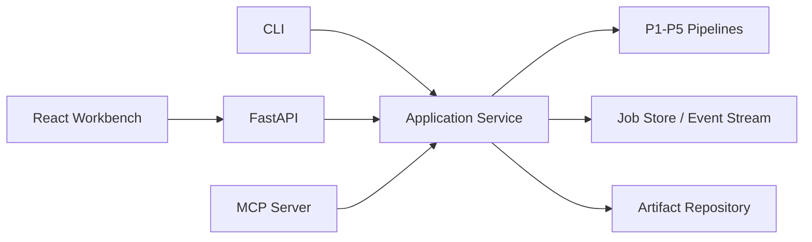

# P6 实施规划 — MCP, FastAPI, and Research Workbench

> **状态**：`Planned`（规划完成，尚未实现）
>
> **前置条件**：P1–P5 公共领域契约稳定
>
> **核心输出**：MCP tools/resources、版本化 FastAPI、React 工作台

## 1. 阶段目标

P6 不再新增核心论文算法，而是把已有能力产品化：通过 MCP 提供机器可调用接口，通过 FastAPI 提供任务/文件/事件 API，通过前端提供上传、运行、查看证据与报告的工作台。

## 2. 统一服务边界



CLI、API 和 MCP 必须复用同一 application service，不各自复制 pipeline 编排。

## 3. FastAPI 规划

### 3.1 资源

| 资源 | 示例能力 |
|---|---|
| Papers | upload、parse、metadata、sections |
| Analyses | PaperNote、MethodAnalysis |
| Reproductions | bundle、experiment run、verification report |
| Library | search、graph query、survey |
| Jobs | create、status、cancel、events |
| Artifacts | metadata、download、hash、provenance |

### 3.2 长任务模型

长任务返回 `202 Accepted + job_id`。客户端通过 `GET /jobs/{id}` 获取快照，通过 SSE 接收状态、trace、log、metric 和 artifact 事件。断线重连使用 event ID/cursor；事件协议必须版本化。

Job 状态机固定为：

```text
queued -> running -> succeeded | failed | cancelled | interrupted
             |
             -> cancel_requested -> cancelled | failed
```

- terminal state 不可回退；retry 创建新 attempt，并保留 parent job/idempotency 关系；
- 同一 idempotency key 只有在 canonical input hash 一致时返回原 job；不一致返回冲突；
- event sequence 在单个 job/attempt 内单调递增，SSE 重连允许重复投递但客户端可去重；
- 进程重启时未完成 job 变为 `interrupted`，不得假装继续运行或成功；
- cancellation 必须等待 agent/backend cleanup 结果，并区分“请求取消”和“已取消”。

### 3.3 API 基线

- `/api/v1` 版本前缀；
- Pydantic request/response；
- 标准错误 envelope 和 request ID；
- idempotency key；
- 上传大小/类型限制；
- cancellation 传播到 pipeline/backend；
- OpenAPI/contract tests；
- 默认绑定 `127.0.0.1`、单 worker、CORS 关闭；
- P7 前只允许本地/受信环境部署。

### 3.4 P6 参考运行时

第一版不引入 Redis/Celery/Kafka。测试使用内存 job/event store；本地参考实现使用
SQLite 持久化 job/attempt/event metadata、受限并发 runner 和 P5 artifact
repository。runner/store 保留 adapter 边界，只有吞吐量、可靠性或多节点部署证据
出现后才引入外部队列。单机模式不能通过增加 `SERVER_WORKERS` 横向扩展，否则
取消、SSE cursor 和内存状态会分裂。

## 4. MCP 规划

### Tools

`parse_paper`、`read_paper`、`analyze_methodology`、`generate_bundle`、`run_experiment`、`verify_reproduction`、`search_library`、`write_survey`。

### Resources

论文、分析、run、report 和 graph view 通过稳定 resource URI 暴露；大 artifact 返回引用而不是内联全部内容。

### 协议要求

- tool schema 与 application service DTO 共源；
- stdio 作为首个传输，远程 transport 后续；
- timeout/cancellation/structured error；
- capability negotiation；
- 不在 tool result 中泄漏 secret、绝对内部路径或超大日志；
- contract tests 验证 schema 与实际响应一致。

## 5. React 工作台规划

首个版本是工作台而非营销页：

- 论文上传/arXiv 输入；
- 作业队列和状态；
- Paper sections/notes/method evidence 查看；
- bundle 文件浏览与 diff；
- experiment logs/metrics/artifacts；
- verification report；
- library search 和 graph view；
- 错误、取消、重试、空状态和权限状态。

需要桌面/移动响应式、键盘可达、屏幕阅读标签、长文本/表格不溢出。图视图服务于研究关系查询，不作为装饰。

## 6. 工作包

### P6.0 Application service 和 DTO

建立统一 use-case 层、job/event/artifact DTO，CLI 逐步复用。

### P6.1 Job runtime

实现状态机、attempt/idempotency、取消、重试、event cursor、重启恢复、并发限制、
测试用内存后端和本地 SQLite reference backend。

### P6.2 FastAPI

实现 v1 routes、OpenAPI、上传、SSE、artifact 下载和 contract tests。

### P6.3 MCP

实现 stdio server、tools/resources、错误映射和兼容性测试。

### P6.4 Frontend

实现工作台导航、任务详情、证据浏览、报告和 library views。

### P6.5 端到端验证

浏览器测试上传→阅读→分析→查看结果；SSE 重连、取消、失败和移动 viewport 均验证。

### P6.6 文档/部署

补 API/MCP reference、前端开发、local compose 和限制；生产公网部署保留到 P7 安全完成后。

## 7. 测试矩阵

| 风险 | 必测场景 |
|---|---|
| API/schema 漂移 | OpenAPI snapshot + DTO contract |
| SSE 断线 | cursor 重连不丢/不重复关键事件 |
| 取消无效 | job→agent→container cancellation |
| 重复提交 | idempotency key 返回同一 job |
| key 复用不同输入 | 返回 conflict，不错误复用旧 job |
| 服务重启 | running job 变为 interrupted，durable events/artifacts 可恢复 |
| 多 worker 误配置 | 单机 backend 拒绝不安全 worker 数或启动失败 |
| 大文件/日志 | 上传与响应上限、artifact 引用 |
| MCP 错误 | structured error、timeout、capabilities |
| UI 状态 | loading/empty/error/cancel/retry/long content |
| 浏览器兼容 | desktop/mobile、console/network error 检查 |

## 8. 非目标

- P6 不宣称生产多租户安全；P7 完成前只支持受信部署；
- 不在 API route 中实现业务逻辑；
- 不建立第二套 artifact storage；
- 不允许前端直接连接 Neo4j、Chroma 或 Docker；
- 不把 MCP 当作远程任意命令执行接口。

## 9. 准入与里程碑提升

P6 转为 `Ready` 前需要 P1–P5 application use-case 和 artifact contract fixture，
并完成 P7.0 的**接口级威胁模型预审**。该预审不代表 P7 完成，只用于防止 P6
冻结明显无法授权或审计的 API/MCP 设计。

- **P6-A（可安全停止）**：application service、DTO、job/attempt/event contract、
  内存/SQLite backend 和 CLI 复用；
- **P6-B**：本地回环 FastAPI + SSE 与 stdio MCP，保持 CORS 关闭且无远程暴露；
- **P6-C（完整阶段）**：React 工作台、桌面/移动浏览器 E2E、故障/取消/重启流程。

P6-B 可以用于本机受信测试，但 P7 完成前不得作为公网或多租户服务发布。

## 10. 完成定义

1. CLI/API/MCP 共享 application service；
2. job/attempt 状态、重启恢复、取消、SSE 重连和 artifact 引用稳定；
3. OpenAPI 与 MCP contract tests 通过；
4. 工作台覆盖核心研究工作流和完整状态；
5. Playwright 桌面/移动、console、network 和视觉检查通过；
6. 默认回环绑定、单 worker、CORS 关闭，文档明确 P7 前的部署限制；
7. P0–P5 全部回归和构建通过。
