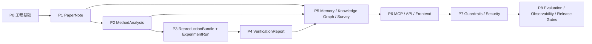

# ReproForge P0–P8 总体路线图

> **更新时间**：2026-08-05
>
> **当前状态**：P0、P1 已完成；P2–P8 已规划但尚未实现
>
> **状态判定原则**：目录、依赖声明、架构图和 `compose.future.yml` 不构成功能完成。只有代码、测试、用户入口、文档和阶段验收全部通过，阶段才能标记为 Complete。

## 1. 路线图目标

ReproForge 的长期目标是把论文阅读、方法抽取、代码生成、实验执行、结果核验和知识沉淀连接成可追踪的复现工作流。路线图按“稳定产物”划分阶段，而不是按技术名词堆叠功能。

## 2. 阶段总览

| 阶段 | 状态 | 核心问题 | 稳定交付物 |
|---|---|---|---|
| P0 | Complete | 项目如何可靠开发、测试、构建和发布？ | Core types、BaseAgent、Provider contract、CI/docs/package |
| P1 | Complete | 如何把论文变成可追踪阅读笔记？ | `Paper`、`PaperChunk`、`PaperNote`、PaperPipeline、CLI |
| P2 | Planned | 如何把方法学结论绑定到原文证据？ | `MethodAnalysis`、`EvidenceRef`、`EquationEvidence`、`ReportedClaimDraft` |
| P3 | Planned | 如何把方法转换为可审计代码并隔离执行？ | `ReproductionBundle`、`ExperimentSpec`、`ExperimentRun` |
| P4 | Planned | 如何检查数学与复现结果是否支持论文声明？ | `MathCheckReport`、`VerificationReport`、复现报告 |
| P5 | Planned | 如何跨会话沉淀、关联和综述研究知识？ | Memory records、Knowledge Graph、`SurveyReport` |
| P6 | Planned | 如何通过标准协议和用户界面使用能力？ | MCP、FastAPI jobs/SSE、React 工作台 |
| P7 | Planned | 如何系统控制输入、工具、执行、输出和权限风险？ | Guardrail policy、audit、security gates |
| P8 | Planned | 如何量化质量、成本、性能和回归？ | Benchmark suite、OTel telemetry、release scorecard |

## 3. 状态生命周期与实施准入

| 状态 | 含义 | 允许的动作 |
|---|---|---|
| `Planned` | 范围和方向已记录，但尚未通过实施准入 | 设计评审、fixture/契约草案、风险验证 |
| `Ready` | Definition of Ready 全部满足 | 可以开始本阶段实现 |
| `In Progress` | 已有代码工作包进入实现 | 只能按已评审边界推进并持续更新证据 |
| `Complete` | 完成定义和全部适用阶段门通过 | 下游可以依赖公开契约 |
| `Deferred` | 主动延期，不再占用当前交付承诺 | 保留原因、恢复条件和已有产物 |

阶段从 `Planned` 进入 `Ready` 前必须满足 Definition of Ready：

1. 上游阶段为 `Complete`，或所需上游契约已有明确、只读的版本化 fixture；
2. 目标、非目标、输入、输出、错误语义和兼容边界已经评审；
3. 至少一个正常 fixture 和一个关键失败 fixture 可离线使用；
4. 工作包顺序、测试矩阵、安全/数据风险和外部依赖已列出；
5. 需要真实 API、Docker、数据库、GPU 或付费资源的动作有独立 smoke 计划和预算边界；
6. 阻断决策与非阻断决策分开记录，实施负责人和评审责任明确；
7. 可安全停止的中间里程碑明确，停止时不会把部分能力标成 `Complete`。

当前 P2 仍为 `Planned`：下一步是完成 P2.0 schema/evidence fixture 评审后转为
`Ready`。P3–P8 不得在其前置条件未满足时提前转为 `Ready`。

## 4. 跨阶段稳定契约

| 生产阶段 | 产物 | 主要消费阶段 | 不允许依赖的内部细节 |
|---|---|---|---|
| P1 | `Paper`, `PaperNote` | P2、P5 | PaperReader conversation/prompt |
| P2 | `MethodAnalysis`, `EvidenceRef`, `EquationEvidence`, `ReportedClaimDraft` | P3、P4、P5 | Methodologist 私有 trace/prompt |
| P3 | `ReproductionBundle`, `ExperimentRun` | P4、P5 | Docker SDK 原生对象、临时目录 |
| P4 | `VerificationReport` | P5、P6、P8 | Verifier conversation |
| P5 | Repository/Graph/Survey contracts | P6、P8 | Chroma/Neo4j 私有 client 对象 |
| P6 | API/MCP contracts | P7、外部客户端 | Python 内部对象 |
| P7 | PolicyDecision/AuditEvent | P8、运营 | Guardrail 实现细节 |
| P8 | EvaluationResult/Trace schema | 发布流程 | 单个 provider 私有字段 |

所有跨阶段产物必须：Pydantic 校验、JSON 可序列化、包含 schema/version 字段、支持确定性 fixture，并能从公共 import 路径访问。

## 5. 阶段门

每个阶段必须依次通过：

1. **Contract Gate**：输入、输出、错误和版本契约通过评审；
2. **Offline Gate**：不依赖真实 LLM/网络/Docker 的确定性测试通过；
3. **Integration Gate**：与上一阶段公共 API 集成且回归通过；
4. **External Gate**：需要的真实 provider/服务 smoke test 通过；
5. **User Gate**：Python API、CLI/API/UI 中本阶段承诺的入口可用；
6. **Documentation Gate**：设计、技术参考、示例、故障排查和状态页一致；
7. **Build Gate**：pytest、Ruff、mypy、MkDocs、wheel/build 全部通过；
8. **Security/Data Gate**：适用的输入信任、secret、许可、保留/删除和执行边界通过；
9. **Evidence Gate**：阶段验收记录包含版本、命令、结果、已知限制和未豁免阻断项。

某个 gate 不适用时必须写出原因，不能简单省略。外部 gate 失败时可以保留已通过
的离线里程碑，但阶段状态不能提升为 `Complete`。

## 6. 各阶段摘要

### P0：工程基础（已完成）

交付 Agent 类型系统、ReAct 生命周期、Provider 抽象、uv 锁文件、Ruff、mypy、pytest、CI/CD、文档构建、包构建和开源治理。P0 不承诺业务 Agent 或后续服务已实现。

详见 [P0 设计论证](P0-DESIGN-RATIONALE.md) 和 [P0 技术参考](P0-TECHNICAL-REFERENCE.md)。

### P1：论文阅读（已完成）

交付 PDF/arXiv 输入、论文领域模型、token-aware 分块、PaperReader、OpenAI-compatible/DeepSeek Provider、PaperPipeline 和 CLI。稳定输出为 `PaperNote`，不是复现报告。

详见 [P1 实现手册](P1-IMPLEMENTATION-GUIDE.md)。

### P2：证据化方法抽取（规划）

Methodologist 从 `Paper` 和可选 `PaperNote` 抽取算法、架构、训练配置与评价协议。
关键声明通过带 source/section/quote hash 的 `EvidenceRef` 回到 canonical `Paper`；
公式使用 `EquationEvidence` 显式表示 captured/partial/not_available，论文结果使用
保留 raw value/unit/split/status 的 `ReportedClaimDraft`。P2 不补造缺失公式，也不
提前执行属于 P4 的数值规范化和可比性判断。

详见 [P2 实施规划](P2-IMPLEMENTATION-PLAN.md)。

### P3：代码生成与隔离实验（规划）

CodeForger 将 `MethodAnalysis` 转换为可审计源码、配置、依赖清单和测试；Experimentor 在最小安全沙箱中 dry-run/build/run，产出结构化日志、指标和 artifact manifest。P3 不判断论文是否复现成功。

详见 [P3 实施规划](P3-IMPLEMENTATION-PLAN.md)。

### P4：数学与结果核验（规划）

MathChecker 检查公式符号、维度和推导缺口；Verifier 将论文声明与 `ExperimentRun` 按 metric/dataset/split 对齐，输出差异、容差结论和证据。稳定产物是 `VerificationReport`。

详见 [P4 实施规划](P4-IMPLEMENTATION-PLAN.md)。

### P5：记忆、知识图谱和综述（规划）

将 P1–P4 产物持久化为版本化记录，建立 Paper–Method–Dataset–Metric–Run–Evidence 图关系，并由 SurveyScribe 在引用完整性约束下生成跨论文综述。

详见 [P5 实施规划](P5-IMPLEMENTATION-PLAN.md)。

### P6：协议、服务与前端（规划）

把稳定领域能力暴露为 MCP tools/resources、FastAPI job API 和 React 工作台。长任务采用 job + SSE，前端支持上传、状态、trace、artifact 和报告浏览。生产部署安全需等待 P7。

详见 [P6 实施规划](P6-IMPLEMENTATION-PLAN.md)。

### P7：安全、护栏和治理（规划）

建立输入注入检测、工具权限、沙箱策略、secret 防泄漏、代码扫描、输出证据/抄袭检查、认证授权、审计日志和安全测试。P3 的最小执行隔离是前置安全条件，P7 提供平台级纵深防御。

详见 [P7 实施规划](P7-IMPLEMENTATION-PLAN.md)。

### P8：评测、可观测性和发布门（规划）

建立覆盖阅读、方法、代码、实验、验证、综述和安全的 benchmark；使用 OpenTelemetry 统一 trace/metrics/cost；建立回归阈值、质量 scorecard 和发布证据。

详见 [P8 实施规划](P8-IMPLEMENTATION-PLAN.md)。

## 7. 统一测试策略

| 层 | 默认外部依赖 | 目的 |
|---|---|---|
| Unit | 无 | schema、算法、错误分支、policy |
| Integration | fake/in-memory | 跨模块契约和重复运行 |
| Contract | mock server/container | API/MCP/provider/schema 兼容 |
| E2E | 显式服务 | 真实用户工作流 |
| Smoke | DeepSeek/arXiv/Docker/Neo4j 等 | 外部集成可用性 |
| Benchmark | 固定数据集和模型配置 | 质量、性能、成本回归 |

真实 API、Docker 和数据库测试必须显式标记，不能让普通单元测试产生费用或依赖网络。

## 8. 版本、变更与回退策略

- P0/P1 的公共 import 和 CLI 命令必须持续兼容；
- 新阶段优先增加新顶层产物，不在已有模型中塞入无关字段；
- schema 发生破坏性变化时增加 schema version 和迁移器；
- artifact manifest 使用内容哈希，避免只靠临时路径引用；
- producer 和 consumer 必须共享 golden contract fixture，不能各自复制相似 schema；
- 上游 artifact 只读；修正通过派生新版本表达，不原地覆盖历史证据；
- 存储迁移优先 copy-on-write/备份后切换，索引和缓存必须可从事实源重建；
- 高风险能力使用显式 feature flag 或 backend 选择，回退时不破坏已有 artifact；
- 破坏性决策记录影响、迁移路径、回退路径和受影响消费者；
- 文档中的 Planned 只有在阶段门全部通过后才能改为 Complete；
- 每次阶段完成都更新 README、MkDocs 首页、架构图、CHANGELOG 和 capability 输出。

## 9. 增量里程碑与安全停止点

路线图不在缺少人员和容量信息时编造日历工期，使用可验收里程碑排序：

| 阶段 | 第一个安全停止点 | 第二个安全停止点 | 完整阶段门 |
|---|---|---|---|
| P2 | schema + evidence/claim/equation fixtures | Methodologist + offline pipeline | API/CLI、真实 smoke、全部回归 |
| P3 | bundle manifest + static validation + dry-run | 受限 fixture runner | 最小安全 Docker backend |
| P4 | claim/metric/equation normalization | MathChecker + coverage/unknown | Verifier + 可重建 JSON/Markdown 报告 |
| P5 | versioned artifact repository | rebuildable Chroma/graph indexes | SurveyScribe + 运维/恢复 |
| P6 | application service + durable job/event contract | FastAPI + MCP | 完整工作台和浏览器 E2E |
| P7 | threat model + identity/policy skeleton | guardrails + execution/supply-chain gates | 攻击回归、审计和事件响应 |
| P8 | evaluation manifest + seed corpus | 分阶段 benchmark + telemetry | scorecard、预算和发布阻断 |

到达安全停止点只说明对应 artifact 可评审，不改变阶段总体状态。每个里程碑都必须
附离线验证命令和已知限制，后续工作可以在不丢失证据的情况下继续。

## 10. 实施顺序与运行时顺序

P0→P8 是**实现顺序**，不是最终运行时必须串行的唯一顺序。P4 完成后，运行时
可以在 P2 之后先执行 MathChecker，再将 `MathCheckReport` 作为 P3 的可选
preflight 输入；Verifier 仍必须等待 P3 的 `ExperimentRun`。P3 初次实现不能
反向依赖尚未完成的 P4，P4 也不能修改 P2/P3 历史 artifact，只能产生派生报告。

P8 的平台化评测在最后实现，但每个阶段必须从第一天保留小型 golden/attack
fixture 和局部质量指标。P8 负责统一 manifest、统计、历史基线和发布门，不负责
事后补救前面阶段完全缺失的测试数据。

## 11. 已冻结默认值与待决策项

| 主题 | 当前默认值 | 重新评审时机 |
|---|---|---|
| P2 公式来源 | 保留原始文本/编号和证据；解析失败显式标记，不重建“看起来正确”的公式 | 有可靠 LaTeX/source parser 证据时 |
| P3 执行 | dry-run + 受限 CPU Docker；不支持远程账号/付费资源 | 本地 sandbox gate 稳定后 |
| P5 事实源 | 本地 artifact + SQLite metadata；Chroma/Neo4j 仅可重建索引 | 容量/并发数据证明需要替换时 |
| P6 部署 | 单机、本地回环、CORS 关闭、受信用户 | P7 身份/授权/审计完成后 |
| P7 身份提供方 | 先定义 provider-neutral subject/tenant contract | 部署目标明确后 |
| P8 阈值 | 不预填拍脑袋数值；由版本化基线、样本量和风险等级评审 | seed benchmark 有稳定结果后 |

## 12. 当前优先级

当前唯一允许推进准入并在转为 `Ready` 后进入实现的下一阶段是 P2。P3–P8 的规划
用于冻结边界、减少返工，不表示可以绕过前置阶段并行宣称完成。若某个后续基础
能力必须提前实现，只能作为前置阶段的最小内部组件，不能提前扩大阶段状态。
