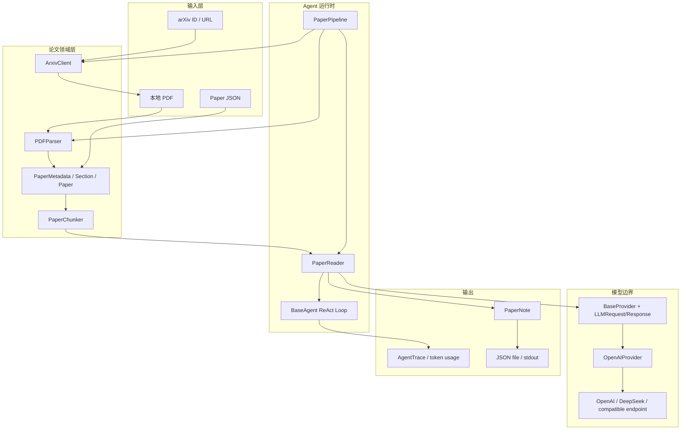
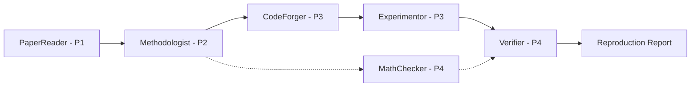

# 架构总览

本文把 **当前可运行的 P1/P2 架构** 与 **P3–P8 目标架构** 分开描述。判断功能是否完成，应以当前代码、测试和阶段技术参考为准，而不是以空目录或路线图图示为准。

## 当前状态

| 层级 | 已实现 | 尚未实现 |
|---|---|---|
| 用户入口 | Python API、`repro-forge` CLI | Web UI、REST/SSE API |
| 领域能力 | PDF/arXiv、论文模型、分块、PaperReader、PaperNote、Methodologist、MethodAnalysis | 代码生成、实验、核验 |
| Agent | `PaperReader` | Methodologist、MathChecker、CodeForger、Experimentor、Verifier |
| Provider | OpenAI-compatible，包括 DeepSeek 和本地 endpoint | 独立 Anthropic/本地 Provider 实现 |
| 基础设施 | P0 core/types/trace、质量工具链 | Memory、知识图谱、MCP、Guardrails、Observability |

## P1 运行架构



## 模块职责

### 1. P0 核心运行时 (`core/`)

`BaseAgent` 负责 `setup → think → act → observe → finalize → teardown` 生命周期、状态迁移、步数上限和 `AgentTrace`。P1 没有复制 Agent 循环，而是让 PaperReader 实现论文领域的各个 hook。

### 2. 论文领域层 (`paper/`)

- `schemas.py`：稳定的 `Paper`、`Section`、`PaperChunk`、`PaperNote` 数据契约；
- `pdf_parser.py`：逐页提取文本、识别常见英文论文标题、记录页码；
- `arxiv_api.py`：搜索、元数据、现代/旧式 ID 归一化和安全文件名下载；
- `chunker.py`：在 token 预算内保留章节和段落边界；
- `pipeline.py`：以依赖注入组合 parser、arXiv client、reader 和 provider。

### 3. PaperReader (`agents/paper_reader.py`)

PaperReader 使用三个本地只读工具：

| 工具 | 作用 |
|---|---|
| `list_sections` | 获取论文结构 |
| `read_section` | 按标题和章节内 chunk 编号读取 |
| `search_paper` | 搜索全文并保留章节归因 |

模型通过 native tool calls 或兼容文本回退选择工具。达到步数预算后，reader 会关闭 pending tool calls 并执行一次无工具最终总结，输出经 Pydantic 校验的 `PaperNote`。

### 4. Provider 层 (`providers/`)

`BaseProvider` 定义统一的异步请求、响应、工具调用和流式接口。`OpenAIProvider` 是 P1 唯一真实实现，可连接 OpenAI、DeepSeek、Qwen、vLLM、Ollama 等兼容 chat completions 的服务。不同模型的推理质量和协议细节仍属于外部差异。

### 5. CLI (`cli.py`)

CLI 暴露版本、能力清单、PDF 阅读和 Paper JSON 阅读。它从当前目录 `.env` 加载配置，远程 endpoint 要求 key，本地/私有 endpoint 可以 keyless 运行。

## 依赖方向

```text
CLI / 用户代码
    ↓
PaperPipeline
    ↓
PaperReader ─────────→ BaseProvider
    ↓                     ↓
Paper / Chunk         OpenAIProvider
    ↓
PDFParser / ArxivClient
```

编排依赖 `Protocol` 和抽象，而不是把具体 client 写死，因此测试可以注入 fake parser、fake arXiv client 和 FakeLLMProvider。

## 关键数据流

### 本地 PDF

```text
read-pdf → PDFParser.parse → Paper → PaperReader.read → PaperNote → JSON
```

### arXiv

```text
read_arxiv → normalize ID → download PDF → parse → read → PaperNote
```

### 已序列化论文

```text
read-json → Paper.model_validate_json → PaperReader.read → PaperNote
```

## P2–P8 目标架构

ReproForge 的长期目标仍是多 Agent 复现平台：



Memory/ChromaDB、Neo4j、MCP、FastAPI、前端、Guardrails、Evaluation 和 Observability 都属于后续阶段。相应文档当前用于记录设计方向，不构成已实现声明。

## P0-P8 阶段架构

后续建设不再用一张终态架构图代替实施边界。每个阶段必须产出可版本化的稳定
契约：P2 `MethodAnalysis/EvidenceRef/EquationEvidence/ReportedClaimDraft`、P3 `ReproductionBundle/ExperimentRun`、P4
`VerificationReport`、P5 repository/graph/survey、P6 API/MCP/UI、P7 policy/audit、
P8 benchmark/telemetry/scorecard。完整阶段门见 [总体路线图](../ROADMAP.md)。

## 延伸阅读

- [P1 设计论证](../P1-DESIGN-RATIONALE.md)
- [P1 技术参考](../P1-TECHNICAL-REFERENCE.md)
- [P0-P8 总体路线图](../ROADMAP.md)
- [P2 实施规划](../P2-IMPLEMENTATION-PLAN.md)
- [P3 实施规划](../P3-IMPLEMENTATION-PLAN.md)
- [P4 实施规划](../P4-IMPLEMENTATION-PLAN.md)
- [P5 实施规划](../P5-IMPLEMENTATION-PLAN.md)
- [P6 实施规划](../P6-IMPLEMENTATION-PLAN.md)
- [P7 实施规划](../P7-IMPLEMENTATION-PLAN.md)
- [P8 实施规划](../P8-IMPLEMENTATION-PLAN.md)
- [P0 设计论证](../P0-DESIGN-RATIONALE.md)
- [P0 技术参考](../P0-TECHNICAL-REFERENCE.md)
