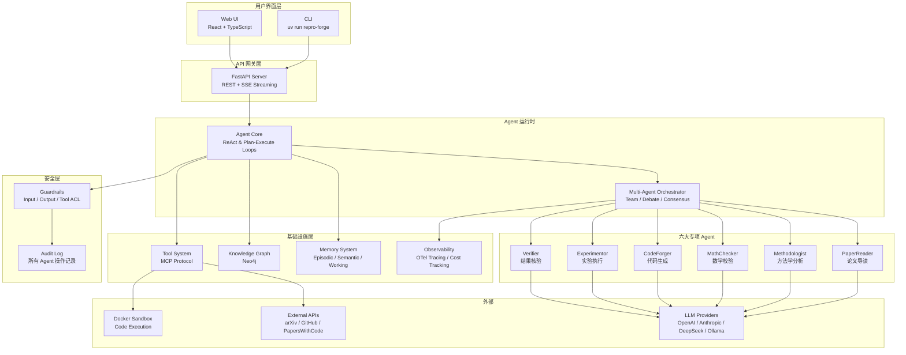

# 架构总览

ReproForge 采用分层事件驱动架构，由 9 个核心子系统构成。

---

## 系统架构图



---

## 核心子系统

### 1. Agent 运行时 (`core/`)

位于架构中心，实现 ReAct (Reason + Act) 循环和 Plan-Execute 循环。

```
┌─────────────────────────────────────────────────┐
│                  BaseAgent                       │
│  ┌──────────────────────────────────────────┐   │
│  │          ReAct Loop                        │   │
│  │                                           │   │
│  │   think() ──► act() ──► observe()         │   │
│  │      ▲                       │            │   │
│  │      └─── should_stop? ──────┘            │   │
│  │               │                           │   │
│  │           finalize()                      │   │
│  └──────────────────────────────────────────┘   │
│                                                  │
│  Stream 模式: yield TraceStep per iteration     │
└─────────────────────────────────────────────────┘
```

### 2. 多 Agent 编排 (`multi_agent/`)

| 模式 | 描述 | 适用场景 |
|------|------|---------|
| **Sequential** | Agent 按序执行 | 导读 → 方法分析 → 代码生成 |
| **Handoff** | 任务转交 | PaperReader 发现需要 Methodologist 时移交 |
| **Delegate** | 子任务委派 | Orchestrator 分配章节给多个 PaperReader |
| **Debate** | 多轮辩论 | MathChecker + Verifier 就推导分歧进行讨论 |
| **Broadcast** | 广播 | 通知所有 Agent 论文更新/引用变更 |

### 3. Memory 系统 (`memory/`)

三阶记忆架构：

| 层级 | 存储 | 容量 | 生命周期 | 检索方式 |
|------|------|------|---------|---------|
| **Working** | Agent 上下文窗口 | ~128K tokens | 单次会话 | 全量可用 |
| **Episodic** | ChromaDB 向量库 | 数十万条 | 跨会话持久 | 向量相似度 |
| **Semantic** | Neo4j 知识图谱 | 百万级节点 | 永久 | 图查询 |

### 4. Reproduction 管道 (`reproduction/`)

论文复现的核心数据流：

```
Paper → Algorithm Extraction → Code Generation → Docker Execution → Verification → Report
  │            │                     │                  │                 │            │
  │      Methodologist          CodeForger        Experimentor       Verifier    Markdown/LaTeX
  │            │                     │                  │                 │            │
  │      提取: 算法、架构、         生成: model.py      执行: 训练/评估      对比: 指标偏差
  │      损失、超参、数据            train.py            MLflow 记录        统计检验
  └── PaperReader ────────────── SurveyScribe ─────────────────────────────────────────────┘
                                          │
                                      知识图谱驱动的综述生成
```

### 5. MCP 协议层 (`mcp/`)

实现 Model Context Protocol，标准化 Agent 与外部工具的通信：

```
Agent                         MCP Server                   External
  │                               │                           │
  │  list_tools()                 │                           │
  ├──────────────────────────────►│                           │
  │  [tool1, tool2, ...]         │                           │
  │◄──────────────────────────────┤                           │
  │                               │                           │
  │  call_tool("arxiv_search", {}) │                          │
  ├──────────────────────────────►│                           │
  │                               │  GET /api/query?q=...    │
  │                               ├──────────────────────────►│
  │                               │  [results]               │
  │                               │◄──────────────────────────┤
  │  {content: "...", data: ...}  │                           │
  │◄──────────────────────────────┤                           │
```

### 6. Provider 层 (`providers/`)

统一的 LLM 调用抽象：

```python
class BaseProvider(ABC):
    async def generate(request: LLMRequest) -> LLMResponse
    async def generate_stream(request: LLMRequest) -> AsyncIterator[str]
    async def count_tokens(text: str) -> int

# 实现
OpenAIProvider(BaseProvider)      # OpenAI / DeepSeek / Qwen / vLLM / Ollama
AnthropicProvider(BaseProvider)   # Claude
LocalProvider(BaseProvider)       # Ollama / 本地模型
```

### 7. 安全护栏 (`guardrails/`)

环绕所有 Agent 操作的安全层：

```
Input Message
    │
    ▼
┌──────────────┐
│ Input Guard   │  ── 脱敏、注入检测、合法内容校验
└──────┬───────┘
       │ ✅
       ▼
   Agent 处理
       │
       ▼
┌──────────────┐
│ Tool Policy   │  ── 工具调用权限校验、操作白名单
└──────┬───────┘
       │ ✅
       ▼
   Tool 执行
       │
       ▼
┌──────────────┐
│ Output Guard  │  ── 输出过滤、抄袭检测、合理性校验
└──────┬───────┘
       │ ✅
       ▼
   Output Message
```

### 8. 可观测性 (`observability/`)

| 维度 | 工具 | 采集内容 |
|------|------|---------|
| **Trace** | OpenTelemetry → Jaeger | 每个 ReAct 步骤的 Span（think / act / observe） |
| **Cost** | 自定义 tracker | Token 用量 × 单价 = 实时成本 |
| **Metrics** | Prometheus 兼容 | 延迟、成功率、步数分布 |
| **Logs** | structlog → JSON | 结构化日志，每行一个 Agent 事件 |

### 9. 评测体系 (`evaluation/`)

内置 Benchmark：

| Benchmark | 评测对象 | 指标 |
|-----------|---------|------|
| Paper QA | PaperReader | 问答准确率 |
| Algorithm Extraction | Methodologist | 算法提取完整性 |
| Code Correctness | CodeForger | 生成代码能否运行 / 测试通过 |
| Reproduction Fidelity | 全管道 | 复现指标偏差百分比 |
| Survey Quality | SurveyScribe | 综述覆盖度 / 引用准确率 |

---

## 数据流决策

### 同步 vs 异步

- **Agent 间通信**：异步（`asyncio`），多个 Agent 可并发执行
- **LLM 调用**：异步流式（SSE / WebSocket）
- **工具调用**：部分异步（API 查询）、部分同步（文件 I/O）
- **实验执行**：异步启动 Docker 容器，回调通知结果

### 状态管理

- **Agent 状态**：内存管理，通过 `AgentState` 枚举追踪
- **任务状态**：`TaskResult` 序列化，支持持久化
- **长期记忆**：ChromaDB 和 Neo4j 外部存储
- **配置**：Pydantic 模型，从 `.env` / YAML / API 参数加载
