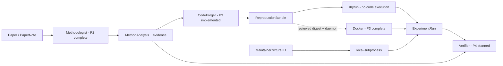

# Reproduction Pipeline（P3 已完成，P4 规划）

当前流程已经从 P2 的 `MethodAnalysis` 延伸到 P3 的可审计 bundle 和结构化运行记录：

## 当前实现边界

- P2 `MethodAnalysis` 是 CodeForger 的唯一方法事实输入；CodeForger 不读取
  Methodologist 私有 prompt/conversation。
- CodeForger 递归验证 evidence ID，生成版本化文件/实验计划，并在一次 repair 后
  强制重新校验；无法形成合法 bundle 时抛出 `GenerationError`。
- `ReproductionBundle` 自动包含 `reproforge-manifest.json`，manifest hash 覆盖代码、
  实验声明、证据、假设、未解决项和 generation trace。
- `dryrun` materialize 并验证 bundle，但不执行任何生成代码。
- `local-subprocess` 只接受仓库不可变 registry 中的 fixture ID；调用者不能提交代码
  或 `FixtureSpec` 进入宿主执行。
- Docker backend 使用精确 digest、默认断网、非 root、只读 rootfs、资源限制、
  安全挂载、受限输出采集和 cleanup，并已通过真实 daemon security smoke。
- `ExperimentRun` 记录状态、错误码、环境、日志 tail、结构化 metric 和 artifact 摘要；
  stdout/stderr 不会自动升级为可信指标。

## 安全停止点

| 里程碑 | 当前状态 | 可声称能力 |
|---|---|---|
| P3-A | 已实现并离线验证 | bundle、manifest、静态检查、dry-run |
| P3-B | 已实现并离线验证 | 固定 fixture 的本地 runner、timeout、日志、metric、cleanup |
| P3-C | 已实现并通过真实 security smoke | digest-pinned offline Docker sandbox |

P4 将在此基础上对 equation、reported claim 和 observed metric 做独立对齐与判断。
P3 本身不输出“复现成功/失败”的论文级结论。

更多说明：

- [P3 设计论证](../P3-DESIGN-RATIONALE.md)
- [P3 技术参考](../P3-TECHNICAL-REFERENCE.md)
- [P3 实施规划](../P3-IMPLEMENTATION-PLAN.md)
- [P4 实施规划](../P4-IMPLEMENTATION-PLAN.md)
