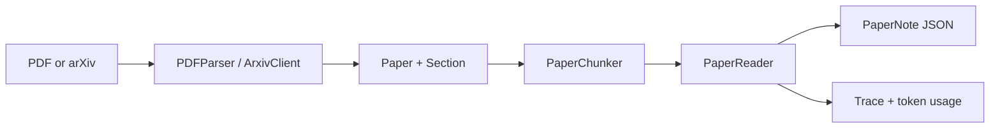
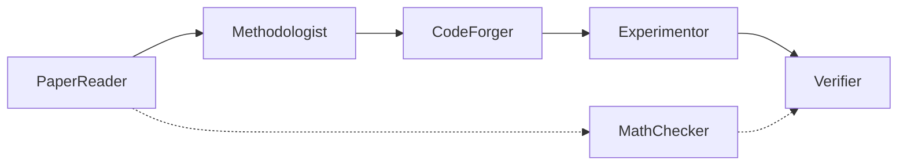

# ReproForge Documentation

Welcome to the ReproForge documentation. ReproForge is being built as a
multi-agent framework for computer-science paper reading and reproduction. The
current release is a working P1 paper-reading system; the full reproduction
platform remains the roadmap target.

!!! note "Current project status"

    P0 and P1 are implemented. P1 provides PDF/arXiv paper ingestion,
    token-aware chunking, the PaperReader agent, provider injection, and a
    `PaperPipeline`/CLI surface. Method extraction, reproduction execution,
    knowledge graph, API, and frontend remain roadmap work.

    See [P1 Design Rationale](P1-DESIGN-RATIONALE.md) for the decisions behind
    the implementation and [P1 Technical Reference](P1-TECHNICAL-REFERENCE.md)
    for APIs, commands, environment variables, failure modes, and verification.
    Developers continuing the implementation should also read the
    [P1 Implementation Guide](P1-IMPLEMENTATION-GUIDE.md).

    The next planned phase is [P2 Evidence-Grounded Methodology
    Extraction](P2-IMPLEMENTATION-PLAN.md). P2 will produce a validated
    `MethodAnalysis` with source-bound evidence, explicit equation capture
    status, and raw reported-claim drafts; code generation remains P3 and
    knowledge-graph writes remain P5. P2 is still `Planned`: P2.0 contract and
    fixture review must pass before the phase becomes `Ready`.

## What is ReproForge?

ReproForge addresses the **reproducibility crisis** in computer science. P1
implements the first vertical slice: turn a local PDF or arXiv paper into a
structured, traceable `PaperNote`. The six-agent pipeline described below is
the target architecture, not the current executable surface.

<div class="grid cards" markdown>

- :material-book-open-page-variant: **Paper Deep-Dive**

    ---

    Parse a PDF or download from arXiv, then get a structured note with TL;DR,
    contributions, methodology summary, findings, strengths, and questions.

    [:octicons-arrow-right-24: P1 quickstart](getting-started/quickstart.md)

- :material-flask-round-bottom: **Paper Reproduction (Roadmap)**

    ---

    From algorithm to code to verified results. Generated code runs in
    Docker sandboxes with automatic metric comparison against claimed results.

    [:octicons-arrow-right-24: Reproduce a paper](user-guide/reproduction.md)

- :material-graph: **Knowledge Graph (Roadmap)**

    ---

    Build and query a Neo4j graph of papers, methods, benchmarks, and their
    relationships. Trace method evolution paths across papers.

    [:octicons-arrow-right-24: Explore knowledge graph](architecture/knowledge-graph.md)

- :material-robot: **Multi-Agent System (P1: PaperReader only)**

    ---

    Six specialized agents orchestrated via ReAct + Plan-Execute loops:
    PaperReader, Methodologist, MathChecker, CodeForger, Experimentor, Verifier.

    [:octicons-arrow-right-24: Architecture](architecture/overview.md)

- :material-cloud-braces: **MCP Protocol (Roadmap)**

    ---

    Full Model Context Protocol Server/Client implementation. Standardize
    access to arXiv, GitHub, PapersWithCode, and custom tools.

    [:octicons-arrow-right-24: MCP Integration](architecture/mcp-integration.md)

- :material-shield-check: **Safety & Guardrails (Roadmap)**

    ---

    Input/output validation, code security review, plagiarism detection, and
    result plausibility checks to ensure responsible agent behavior.

    [:octicons-arrow-right-24: Security](architecture/reproduction-pipeline.md)

</div>

## Current P1 Data Flow



## Target Architecture Concepts

The following concepts explain the planned end state. Only the P1 components
identified in the status table are implemented today.

ReproForge is built around five core abstractions:

### 1. Agents

Each agent is a specialist. Together they form a pipeline:



### 2. Memory (P5 Planned)

Three-tier memory architecture:

| Tier | Storage | Purpose |
|------|---------|---------|
| Working | Agent context window | Current conversation & active reasoning |
| Episodic | ChromaDB vector store | Past paper analyses & experiment history |
| Semantic | Neo4j knowledge graph | Cross-paper method relationships & benchmarks |

### 3. Tools (P1 Current, P2–P7 Planned Evolution)

P1 PaperReader owns three in-process read-only tools. Later phases expand the
tool surface only after their domain contracts are stable:

- **P2**: evidence lookup for methodology extraction
- **P3/P4**: constrained execution and verification tools
- **P5**: artifact, vector, graph, and survey retrieval
- **P6**: MCP tools/resources backed by the shared application service
- **P7**: identity, policy, approval, and audit wrappers

### 4. Pipeline (P2–P4 Planned)

The reproduction pipeline is a directed workflow:

```
Paper → Algorithm Extraction → Code Generation → Docker Execution → Verification → Report
```

### 5. Evaluation (P8 Planned)

Built-in benchmarks measure agent performance:

- Paper Q&A accuracy
- Algorithm extraction precision
- Generated code correctness
- Reproduction fidelity score

## Project Status

| Phase | Status |
|-------|--------|
| P0 (Core and infrastructure) | ✅ Complete |
| P1 (PaperReader) | ✅ Complete |
| P2 (Methodologist + evidence-grounded methodology extraction) | 📋 Planned |
| P3 (Auditable code + sandboxed experiments) | 📋 Planned |
| P4 (Math + claim/result verification) | 📋 Planned |
| P5 (Memory + knowledge graph + survey) | 📋 Planned |
| P6 (Application service + MCP + API + workbench) | 📋 Planned |
| P7 (Security + guardrails + governance) | 📋 Planned |
| P8 (Evaluation + observability + release gates) | 📋 Planned |

[Read the P0-P8 roadmap :octicons-arrow-right-24:](ROADMAP.md)

The roadmap is authoritative for the `Planned` → `Ready` → `In Progress` →
`Complete` lifecycle, Definition of Ready, stage gates, and safe stopping
milestones. A planned document, empty namespace, optional dependency, or future
Compose service is not an implemented capability.

## Community

- :material-github: [GitHub](https://github.com/selfrestart/26Summer/tree/main/repro-forge)
- :material-forum: [Discussions](https://github.com/selfrestart/26Summer/discussions)
