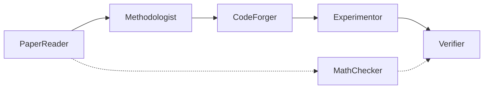

# ReproForge Documentation

Welcome to the ReproForge documentation! ReproForge is a multi-agent framework
for automated computer science paper reading, methodology analysis, and
reproduction.

!!! warning "P0 project status"

    ReproForge is currently an engineering baseline, not an end-to-end paper
    reproduction product. P0 implements the typed core models, abstract Agent
    loop, Provider interface, packaging, tests, and automation. The workflows
    described below are roadmap targets for later phases.

## What is ReproForge?

ReproForge addresses the **reproducibility crisis** in computer science by
automating the end-to-end pipeline of understanding and reproducing research
papers. It employs **six specialized AI agents** that collaborate to read,
analyze, implement, execute, and verify research results.

<div class="grid cards" markdown>

- :material-book-open-page-variant: **Paper Deep-Dive**

    ---

    Upload a PDF or provide an arXiv ID. Get a structured reading note with
    multi-level summaries, methodology analysis, and algorithm extraction.

    [:octicons-arrow-right-24: Get started](getting-started/quickstart.md)

- :material-flask-round-bottom: **Paper Reproduction**

    ---

    From algorithm to code to verified results. Generated code runs in
    Docker sandboxes with automatic metric comparison against claimed results.

    [:octicons-arrow-right-24: Reproduce a paper](user-guide/reproduction.md)

- :material-graph: **Knowledge Graph**

    ---

    Build and query a Neo4j graph of papers, methods, benchmarks, and their
    relationships. Trace method evolution paths across papers.

    [:octicons-arrow-right-24: Explore knowledge graph](architecture/knowledge-graph.md)

- :material-robot: **Multi-Agent System**

    ---

    Six specialized agents orchestrated via ReAct + Plan-Execute loops:
    PaperReader, Methodologist, MathChecker, CodeForger, Experimentor, Verifier.

    [:octicons-arrow-right-24: Architecture](architecture/overview.md)

- :material-cloud-braces: **MCP Protocol**

    ---

    Full Model Context Protocol Server/Client implementation. Standardize
    access to arXiv, GitHub, PapersWithCode, and custom tools.

    [:octicons-arrow-right-24: MCP Integration](architecture/mcp-integration.md)

- :material-shield-check: **Safety & Guardrails**

    ---

    Input/output validation, code security review, plagiarism detection, and
    result plausibility checks to ensure responsible agent behavior.

    [:octicons-arrow-right-24: Security](architecture/reproduction-pipeline.md)

</div>

## Key Concepts

ReproForge is built around five core abstractions:

### 1. Agents

Each agent is a specialist. Together they form a pipeline:



### 2. Memory

Three-tier memory architecture:

| Tier | Storage | Purpose |
|------|---------|---------|
| Working | Agent context window | Current conversation & active reasoning |
| Episodic | ChromaDB vector store | Past paper analyses & experiment history |
| Semantic | Neo4j knowledge graph | Cross-paper method relationships & benchmarks |

### 3. Tools

Agents use tools to interact with the world. All tools are standardized via
the MCP (Model Context Protocol) and can be:

- **Built-in**: arXiv search, GitHub code search, PDF parsing, code execution
- **MCP-hosted**: Any MCP-compatible server can provide tools
- **Custom**: User-defined tools via a simple decorator API

### 4. Pipeline

The reproduction pipeline is a directed workflow:

```
Paper → Algorithm Extraction → Code Generation → Docker Execution → Verification → Report
```

### 5. Evaluation

Built-in benchmarks measure agent performance:

- Paper Q&A accuracy
- Algorithm extraction precision
- Generated code correctness
- Reproduction fidelity score

## Project Status

| Phase | Status |
|-------|--------|
| P0 (Core and infrastructure) | ✅ Complete |
| P1 (PaperReader) | 📋 Planned |
| P2 (Methodologist) | 📋 Planned |
| P3 (CodeForger + Execution) | 📋 Planned |
| P4 (Verifier) | 📋 Planned |
| P5 (Knowledge Graph + Survey) | 📋 Planned |
| P6 (MCP + API + Frontend) | 📋 Planned |
| P7 (Guardrails) | 📋 Planned |
| P8 (Evaluation + Observability) | 📋 Planned |

[View the full roadmap on GitHub :octicons-arrow-right-24:](https://github.com/selfrestart/26Summer/tree/main/repro-forge#roadmap)

## Community

- :material-github: [GitHub](https://github.com/selfrestart/26Summer/tree/main/repro-forge)
- :material-forum: [Discussions](https://github.com/selfrestart/26Summer/discussions)
